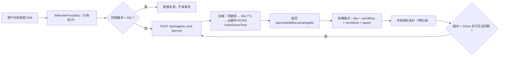

# WorldProbe 天气 + 游戏内时间 · 完整详细实施计划

> 状态：**方案（未实施）** ｜ 生成 2026-10-03 ｜ 依据《WorldProbe 世界 Actor 查询 前端调用文档》（插件 v13，10 图已部署）
> 目标文件：
> - 前端 `dino-import.html`（CF Workers Assets）
> - 后端 `独立后端/dino_backend.py`（工作区镜像）→ 真身 `\\SERVER\dino_backend\dino_backend.py`
> 用户裁定摘要：① 天气按钮 **10 图**、**Bob 不加**；② 时间**直接显示、功能栏左对齐**（不做按钮/面板）、**Bob 不加**；③ 天气面板与火山**完全复用（非复制）**；④ 时间减频三招：**切图才取 / 本地走针 / 15 分钟漂移对齐**；⑤ **后端缓存 + 客户端复用**必须落地

---

## 一、需求（用户口径）

1. 依据交接单，在**每张地图的功能栏**添加「天气查询」按钮，且按钮与面板**完全复用（非复制）火山计时的样式与结构**。
2. 把「CF 开取游戏内时间」纳入本计划并实施（对标 HA 侧 `sensor.ingame_time_cache`，AppDaemon 经 RCON 缓存）：
   - 客户端**切到对应地图时才调用**取时间；
   - 必须有**尽量减少 RCON 取时间频率**的方法；
   - 必须有**后端缓存 + 客户端复用**逻辑；
   - 时间**直接显示在功能栏、左对齐**。
3. 范围裁定：天气 **10 图**（Isl/Sco/Cen/Abe/Ext/Ast/Rag/Val/Los/Gen）——**Bob 不加**；时间同样 **Bob 不加**（实测无响应）。

---

## 二、现状证据（已核对，含锚点）

### 2.1 前端（`dino-import.html`）

| 项 | 位置/结论 |
|---|---|
| 功能条容器 | `#lbFuncBar`（L26657）→ 左 `#lbFuncTitle` + 弹簧 + 右 `#lbFuncActions`（L26662）；`display:none` 默认 |
| 功能条能力表 | `LB_SRV_FUNCS = { Gen:['volcano'] }`（L20376）；按钮定义 `LB_FUNC_DEF`（L20377） |
| 功能条渲染 | `lbRenderFuncBar()`（L20418）：按钮全部由表驱动 ⇒ 加按钮零复制；函数内已有 `tt.textContent=''` 清左侧标题位 |
| 切图钩子 | 切图/换页处已调用 `lbRenderFuncBar()`（L3354、L20866）⇒ 时间取数复用此钩子，**无需新增监听** |
| 火山面板 | `lbVolcanoOpen()`（L20764）：`.lb-picker-overlay` → `.lb-picker-panel` → `.lb-picker-header`（标题+✕）→ `#lbVolcBody`；`lbVolcSync()` 3s 拉、`lbVolcRender()` 1s 重绘；`lbVolcClose()`（L20779）清定时器+移除+刷新功能条 |
| 时间换算常量 | `LB_VOLC.speed = 13.57`（游戏秒/现实秒，本服实测）⇒ 本地走针的唯一依据 |

### 2.2 后端（`独立后端/dino_backend.py`）

| 项 | 位置/结论 |
|---|---|
| RCON 端口表 | `SERVERS`（L85）：11 图含 Bob 32319 |
| 原生文本 RCON | `rcon_command()`（L393）返回原始字节；`list_players()`（L588）为文本解析范式 ⇒ 时间路由照此模式 |
| 天气路由（**已存在**） | `worldprobe_weather()`（L1206）+ `do_POST` 分派（L1970）；TTL `WP_WEATHER_TTL_MS=10000`；注释「本期仅预置路由，UI 不接」 |
| 时间路由 | **不存在**（本次新增） |
| 并发合并范式 | `_WP_LOCKS`（L79）+ `_wp_lock()`（L1111）⇒ 时间路由复用同款范式 |

### 2.3 实测数据（2026-10-03 17:38:59 读 HA `sensor.ingame_time_cache`）

```
Isl: Day 12706, 06:50:07      Sco: Day 5831, 14:45:17
Cen: Day 10386, 06:00:31      Abe: Day 16816, 12:23:55
Ext: Day 8041, 12:57:52       Ast: Day 3324, 18:40:37
Rag: Day 5961, 11:35:27       Val: Day 4556, 16:25:57
Los: Day 3612, 00:05:12       Gen: Day 1161, 23:44:46
Bob: "Server received, But no response!!"   ← 无响应，故不加
```

结论：格式稳定可解析（正则 `Day\s+(\d+),\s+(\d{1,2}):(\d{2}):(\d{2})`）；**天气走插件**（Bob 无插件）、**时间走原生 RCON**。

### 2.4 交接单硬约束（天气渲染）

- `weatherState = null`（畸变）⇒ 按「无数据」展示，**禁止回退解析 `fields`**；
- `weatherState` 键**按存在性渲染**，不得假设齐全；
- 前端不需要 `scan`；`horde` 不展示。

---

## 三、总体设计

### 3.1 数据流



### 3.2 共享壳（「完全复用非复制」的落点）

| 共享函数 | 职责 | 使用方 |
|---|---|---|
| `lbFuncPanelOpen(key, title)` | 建 overlay+panel+header(标题+✕)+正文容器（沿用火山同一套 class/内联样式），返回正文元素 | 火山、天气 |
| `lbFuncPanelClose(key)` | 清定时器 → 移除面板 → `lbRenderFuncBar()` | 火山、天气 |
| `lbFuncPanelPoll(key, fn, ms)` | 轮询骨架（同键单实例） | 火山（3s）、天气（10s） |
| `lbFuncPanelTick(key, render)` | 每秒重绘骨架 | 火山、天气 |

火山侧 `lbVolcanoOpen / lbVolcClose / lbVolcRender / lbVolcPollStart` **保留原名、改薄包装**（只搬不改：DOM 结构、class、内联样式逐字保留）⇒ 零回归。

### 3.3 天气（前端）

- `LB_SRV_FUNCS`：10 图挂 `'weather'`；`Gen: ['volcano','weather']`。
- `LB_FUNC_DEF.weather = { label:'🌦️ 天气查询', color:'#0ea5e9', open:'lbWeatherOpen', title:'实时天气（插件权威数据）' }`。
- `lbWeatherOpen()` → `lbFuncPanelOpen('weather','🌦️ 天气查询 · ' + 图名)`；开窗立即取一次 + 10s 轮询（后端 10s TTL 复用）。
- `lbWeatherSync()` → `POST {LB_API}/api/worldprobe_weather`，body `{server}`。
- `lbWeatherRender()`：
  1. 大字区 = `target`（去 `_C`）+ `confidence` 徽章（high 绿 / medium 黄 / low 灰）；
  2. 中部 = `weatherState` 逐键渲染（雾 / 雨 / 风 / 风向 / 当前天气ID / 下次ID / 距切换…；`family` 标注 `uds` / `ext_gen`）；
  3. `null` ⇒ 「本图天气状态暂不可读（插件未适配该族字段，如畸变）」；
  4. 底部沿用火山同款「数据更新于 X 前」+「数据来自游戏内天气装置」；
  5. 错误文案：`unknown server` → 「该服务器暂不支持」；超时 → 「权威数据不可达：…」；**最多重试 2 次**。

### 3.4 游戏内时间

**后端（新增）**

| 项 | 设计 |
|---|---|
| 路由 | `POST /api/ingame_time`，body `{server, fresh?}`（`fresh=1` 仅调试，跳 TTL） |
| 实现 | `ingame_time(server, fresh=False)`：`rcon_command(RCON_HOST, port, RCON_PASSWORD, 'GetInGameTime')` → decode → 正则解析 → 组 JSON |
| 缓存 | `INGAME_TTL_MS = 60000`；`_INGAME_CACHE[server] = {ts, data}`；命中回填 `cacheAgeMs` |
| 并发 | `_INGAME_LOCKS` + 同键锁（后到者等锁→双检缓存）⇒ **N 客户端合计每图 ≤1 次 RCON/分钟** |
| 错误 | 未知名 → `unknown server`；无响应（Bob）→ `no response` + 原始 `raw`；异常 → `rcon: …` |
| 契约 | 见 §附一 |

**前端（左对齐直显 + 三招减频）**

| 招 | 做法 | 频次效果 |
|---|---|---|
| ① 切图才取 | 复用 `lbRenderFuncBar()` 钩子 → `lbIngameEnsure()`：同图缓存 <60s 直接复用，**不发请求** | 请求数 ≤ 切图次数 |
| ② 本地走针 | 锚点 `{day, secOfDay, recvMono}` + `LB_VOLC.speed`，每秒纯本地推算（`sec = secOfDay + elapsed×13.57`，跨 86400 进位天数） | 0 额外 RCON |
| ③ 漂移对齐 | 仅当缓存 >15 分钟、`document.visibilityState==='visible'`、仍在同图时对齐一次 | ≤4 次/小时/客户端 |

补充规则：
- 页面隐藏 → 停表（`visibilitychange`）；恢复 → 按锚点补齐继续（**不请求**）；
- 非地图页（`LB.tab==='player'`）或 Bob → **不显示**时间位；
- 失败 → `🕒 时间不可用`（tooltip 带原因），下个切图周期再试（不循环重试）；
- 显示文案：`🕒 Day 12706 06:50:07`（12px，左对齐；插在 `#lbFuncTitle` 左侧的新 span `#lbFuncClock`）；
- 换算参考：1 游戏日 = 86400 游戏秒 ≈ 6368 现实秒（≈106 分钟）⇒ 现实每秒 ≈ 走 13.57 游戏秒。

---

## 四、改动清单（文件/函数级）

### 4.1 `独立后端/dino_backend.py`（→ 覆盖真身）

| # | 位置 | 改动 |
|---|---|---|
| 1 | 常量区（L65 附近） | 新增 `INGAME_TTL_MS = 60000`、`_INGAME_CACHE = {}`、`_INGAME_LOCKS = {}` |
| 2 | 函数区（`worldprobe_weather` 附近） | 新增 `ingame_time(server, fresh=False)`（复用 `_wp_lock` 范式做同键锁） |
| 3 | `do_POST`（L1970 附近） | 新增 `elif path.endswith('ingame_time'):` → `self._send(200, ingame_time(server, bool(g('fresh'))))` |
| 4 | 文件头注释（L11-30 路由清单） | 补一行 `POST /api/ingame_time` 说明 |

### 4.2 `dino-import.html`

| # | 位置 | 改动 |
|---|---|---|
| 1 | L20376-20377 | `LB_SRV_FUNCS` 10 图挂 weather（Gen 追加）；`LB_FUNC_DEF` 增 weather 项 |
| 2 | L20764-20795（火山块） | 抽 4 个共享函数；火山改薄包装（只搬不改） |
| 3 | 新增天气块 | `lbWeatherOpen / lbWeatherSync / lbWeatherRender` + `LB._wx = {cache, timer, err}` |
| 4 | 新增时间块 | `lbIngameEnsure / lbIngameFetch / lbIngameRender / lbIngameTickStart / lbIngameTickStop` + `LB._ig = {cache:{}, timer:0, inflight:null}` |
| 5 | L26657-26663 | `#lbFuncBar` 左侧增 `#lbFuncClock` span（`margin-right:8px;font-size:12px;color:#cbd5e1`） |
| 6 | `lbRenderFuncBar()`（L20418） | ① 时间位显隐与文案刷新；② 切图触发 `lbIngameEnsure()`；③ 时间位存在时功能条**也要显示**（原仅按钮驱动） |
| 7 | 底部留白 | 确认 `lbBottomFix()` 与新增左侧文字无冲突（栏高不变） |

---

## 五、部署流程

### 5.1 前端（CF）

1. 改 `dino-import.html` + 递增 `LB_VERSION`（`pwa/sw.js` VER 同步）；
2. `python 'tmp\_deploy_cf.py'`（打包 → wrangler deploy → 线上验证）；
3. 版本一致性：`版本一致: False` 属边缘缓存假象 ⇒ 用 `no-store` 复核。

### 5.2 后端（真身覆盖，重启由用户执行）

1. 备份真身 `\\SERVER\dino_backend\dino_backend.py` → 同目录 `.bak_YYYYMMDD_HHMMSS`，并备份工作区镜像到 `bak\`；
2. 用工作区版本**覆盖真身**（UNC 复制）；
3. 校验：关键字 `ingame_time / INGAME_TTL_MS` 存在 + `py_compile`；
4. **用户在那台机器上跑 `restart_dino_backend.bat`**（本机 schtasks 不可用）；
5. 生效判定：`POST .../api/ingame_time` 不带 username ⇒ **401 = 路由存在**；404 = 进程未重载。

---

## 六、验证清单（线上 PW）

| # | 检查项 | 期望 |
|---|---|---|
| 1 | Gen 功能栏 | 左侧时间 + 右侧「🌋 火山计时」「🌦️ 天气查询」共存 |
| 2 | 时间正确性 | 与 HA `sensor.ingame_time_cache` 同图值一致（±1 分钟内） |
| 3 | 本地走针 | 秒位持续走动；1 现实秒 ≈ 13.57 游戏秒（观察 ≥30s） |
| 4 | 切图才取 | 切走再切回（<60s）**不发新请求** |
| 5 | 跨图缓存复用 | A→B→A（60s 内）不重复请求 |
| 6 | 漂移对齐 | 15 分钟阈值逻辑生效（短测可临时缩短阈值） |
| 7 | 隐藏停表 | 切到其它窗口 → 停表；回来按锚点补齐、无请求 |
| 8 | 天气面板 | Rag/Sco 出数据；Abe ⇒「暂不可读」；Bob 无按钮 |
| 9 | 火山回归 | 抽壳后火山面板排版/文案/倒计时与改造前一致 |
| 10 | 构建自检 | `node --check` 3/3、`U+FFFD=0`、线上版本一致 |
| 11 | Bob | 功能栏**不显示**时间位，也不显示天气按钮 |

---

## 七、风险与对策

| 风险 | 对策 |
|---|---|
| 抽壳回归火山 | 只搬不改 + 抽壳后**先回测火山**再验天气 |
| 时间比例漂移 | 用 HA 值做双采样校验（间隔 ≥2 分钟）；偏差 >30 游戏秒则修正 `speed` 并记录实测值 |
| 后端未重载 | 生效判定 401/404 二分法；未重载时前端降级「时间不可用」，不反复重试 |
| 某图 RCON 无响应（Bob） | 前端不显示；后端保留 `raw` 便于排查 |
| 多客户端并发 | 后端同键锁 + 60s TTL ⇒ 合计每图 ≤1 次 RCON/分钟 |
| 旧 dll 图（天气） | 提示「该服务器暂不支持」，最多重试 2 次 |

---

## 八、实施顺序（获批后）

1. 备份（前端 `dino-import.html` + 后端真身/镜像 + 本报告）；
2. 后端：常量/函数/路由 → `py_compile` → 覆盖真身 → 关键字校验 → **用户重启** → 401 判定；
3. 前端：抽共享壳（火山回测）→ 加天气按钮与面板 → 加时间位与三招减频；
4. 语法自检 → CF 部署 → 线上 PW 按 §六 逐项验证；
5. 本报告补「实施结果」小节 + 进度写盘。

---

## 附一：接口契约

### A. 时间（新增）

请求：`POST https://data.whiterober.ccwu.cc/api/ingame_time`，body `{"server":"Isl"}`

响应（成功）：

```json
{"ok":true,"server":"Isl","raw":"Day 12706, 06:50:07","day":12706,"clock":"06:50:07",
 "secOfDay":24607,"ttlMs":60000,"cacheAgeMs":0,"serverNowMs":1759484400000}
```

响应（Bob 无响应）：

```json
{"ok":false,"server":"Bob","error":"no response","raw":"Server received, But no response!!"}
```

### B. 天气（既有）

请求：`POST /api/worldprobe_weather`，body `{server}` → 插件 JSON（`target / confidence / weatherActorCount / weatherActors / weatherActorDetails / weatherState{family,...}`）+ `cacheAgeMs / serverNowMs`。

---

## 附二：减频量化

| 口径 | 轮询式（未采纳） | 本方案 |
|---|---|---|
| 单客户端 | 每秒 1 次 → 3600 次/时 | 切图才取（含 60s 复用）→ 通常 <10 次/时 |
| 全服（N 客户端） | N×3600 次/时 | ≤60 次/时/图（后端 60s TTL + 同键锁） |
| 极端（11 图全活跃） | N×11×3600 | ≤11 次/分钟（全服合计） |
