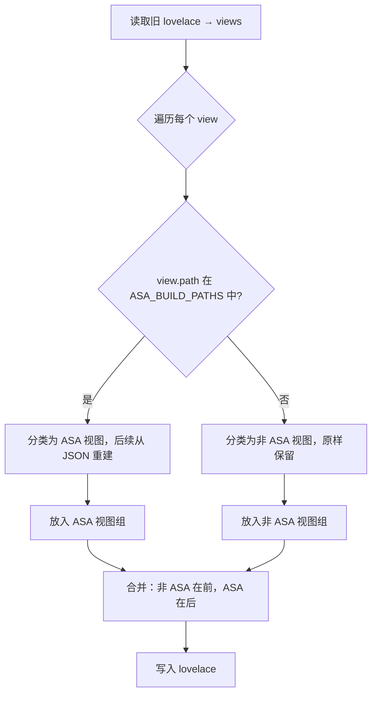

# build_lovelace.py 解耦分析报告

> 生成时间：2026-07-10 | 版本：ASA admin v1203

---

## 1. 问题根因

### 1.1 触发场景

用户手动（或通过其他方式）在 HA lovelace 中新增了一个非 ASA 页面（如"快捷输入"），之后通过 ASA 后台点击「💾 保存Tab」触发 `build_lovelace.py`，新增的页面**被吞掉（丢失）**。

### 1.2 根因代码

`build_lovelace.py` 第 2930-2944 行：

```python
# Rebuild clean view list: keep HA-manual views [0:6], drop stale ASA copies, append old originals
new_views = list(views[0:6])  # 0-5: HA manual, untouched
# Remove all stale ASA copies from the array (anywhere they appear)
keep_after = []
for v in views[6:]:
    p = v.get('path', '')
    if p == 'info_whiterober_old' or p == 'base_whiterober_old':
        keep_after.append(v)
    # Drop everything else (stale ASA views, old padding)
# Pad to target length
while len(new_views) < 22:
    new_views.append({})
views = new_views
```

### 1.3 根因解释

| 行号 | 操作 | 后果 |
|------|------|------|
| `views[0:6]` | 只保留索引 0-5 的视图 | 丢弃所有索引 ≥ 6 的视图 |
| `keep_after` | 仅保留两个特定路径 | 其余全部丢弃 |
| `{}` 填充 | 用空对象填充到 22 个 | 后续用硬编码索引覆盖 |

**结论**：`build_lovelace.py` 采用"全量重建"策略，假设自己对所有视图有完全控制权。任何索引 ≥ 6 的非 ASA 视图都会被无条件丢弃。

---

## 2. 当前耦合架构详解

### 2.1 视图布局现状

| 索引 | 路径 | 标题 | 管理者 | 重建方式 |
|------|------|------|--------|----------|
| 0 | `/lovelace/0` | 家 | **非 ASA** | 从旧 lovelace 原样保留 |
| 1 | `/lovelace/1` | 电视遥控器 | **非 ASA** | 从旧 lovelace 原样保留 |
| 2 | `/lovelace/2` | 工作室 | **非 ASA** | 从旧 lovelace 原样保留 |
| 3 | `/lovelace/3` | 方舟 | **非 ASA** | 原样保留（ASA 后台 saveJSON 写入，build 不管理） |
| 4 | `asa-server-ops` | 服务器操作 | **非 ASA** | 原样保留（ASA 后台 saveJSON 写入，build 不管理） |
| 5 | `ark_patch` | 资讯广场 | **非 ASA** | 原样保留（ASA 后台 saveJSON 写入，build 不管理） |
| 6 | `asa-server-rules` | 服务器规则 | **ASA（build 管理）** | `build_lovelace.py` 从 JSON 重建 |
| 7 | `info_whiterober` | 部落运维速查 | **ASA（build 管理）** | `build_lovelace.py` 从 JSON 重建 |
| 8-18 | `base_*` | 各服基地速查 | **ASA（build 管理）** | `build_lovelace.py` 从 JSON 重建 |
| 19 | `asa-quick-input` | 快捷输入 | **非 ASA** | 原样保留（HA 手动或 ASA 后台独立维护） |
| 20 | `info_whiterober_old` | （旧版保留） | **非 ASA** | 原样保留 |
| 21 | `base_whiterober_old` | （旧版保留） | **非 ASA** | 原样保留 |

### 2.2 耦合类型分析

```
┌─────────────────────────────────────────────────────────┐
│                    build_lovelace.py                     │
│                                                         │
│  ┌──────────┐   ┌──────────┐   ┌──────────────────────┐ │
│  │ 索引耦合  │   │ 全量覆盖  │   │ 隐式依赖旧 lovelace   │ │
│  │          │   │          │   │                      │ │
│  │ views[6] │   │ new_views│   │ 任何索引 ≥ 6 的非 ASA  │ │
│  │ views[7] │   │ = []     │   │ 视图（用户手动新增的） │ │
│  │ views[8] │   │ 然后逐个 │   │ 无条件丢弃，仅两个 old │ │
│  │ ...      │   │ 赋值     │   │ 路径例外              │ │
│  └──────────┘   └──────────┘   └──────────────────────┘ │
│                                                         │
│  致命组合：索引硬编码 + 全量丢弃 = 耦合                  │
└─────────────────────────────────────────────────────────┘
```

### 2.3 三种耦合详细说明

#### 耦合 1：索引硬编码（位置耦合）
- 每个 ASA 视图必须占据固定索引位置（6, 7, 8-18, 19）
- 如果用户手动在索引 6 之前插入新视图，ASA 视图会被挤到错误的索引
- 如果用户手动在索引 6 之后插入新视图，新视图会被 `{}` 覆盖

> 📜 **历史**：2026-07-09 快捷输入丢失后，当时的"修复"是在 `build_lovelace.py` 中新增硬编码索引 19 来容纳快捷输入视图。这并没有解决位置耦合，只是又多了一个硬编码索引。真正的位置耦合从未在代码层面修复。

#### 耦合 2：全量覆盖（生命周期耦合）
- `new_views = list(views[0:6])` — 只有索引 0-5 存活
- `views[6:]` 全部丢弃，仅 `info_whiterober_old`/`base_whiterober_old` 例外
- 任何新增的非 ASA 页面在 `build` 后必然丢失

#### 耦合 3（已排除）：方舟/服务器操作/资讯广场 不属于 build 管理范围
- 方舟(3)、服务器操作(4)、资讯广场(5) 由 ASA 后台 saveJSON 独立写入 lovelace，**不属于 `build_lovelace.py` 的管理范围**
- 当前代码将它们与家/电视遥控器/工作室一起放在 `views[0:6]` 中保留——这是正确的，它们应被视同非 ASA 视图
- **本报告初版误将三者标为「ASA 核心页面」，已修正**

---

## 3. 解耦方案设计

### 3.1 核心原则

> **路径匹配替代索引匹配，增量更新替代全量覆盖。**

```
改造前：读旧 lovelace → 丢弃非 ASA 视图 → 按固定索引重建 ASA 视图 → 写入
改造后：读旧 lovelace → 按路径识别 ASA/非ASA → 更新 ASA 视图 → 保留非 ASA → 写入
```

### 3.2 ASA 视图路径清单（白名单）

定义 `ASA_BUILD_PATHS` 集合——**仅包含 `build_lovelace.py` 真正负责重建的视图**。

> ⚠️ 方舟(`/lovelace/3`)、服务器操作(`asa-server-ops`)、资讯广场(`ark_patch`)、快捷输入(`asa-quick-input`)、旧版保留(`info_whiterober_old`/`base_whiterober_old`) **均不在白名单中**。它们由 ASA 后台 saveJSON 或 HA 手动独立写入 lovelace，build 只需像对待家/电视遥控器/工作室一样原样保留。

```python
ASA_BUILD_PATHS = {
    # 仅包含从 JSON 数据文件重建的 13 个页面
    'asa-server-rules',     # 服务器规则 ← server_rules.json
    'info_whiterober',      # 部落运维速查 ← tribe_ops.json
    'base_isl', 'base_sco', 'base_cen', 'base_abe',
    'base_ast', 'base_ext', 'base_rag', 'base_val',
    'base_los', 'base_gen', 'base_bob',  # 基地速查 x11 ← asa_base_quick_ref.json
}
```

### 3.3 新算法流程



### 3.4 关键改动点

#### 改动 1：替换 `views[0:6]` 全量丢弃逻辑

```python
# 改造前（删除）
new_views = list(views[0:6])
keep_after = []
for v in views[6:]:
    if v.get('path', '') in ('info_whiterober_old', 'base_whiterober_old'):
        keep_after.append(v)
while len(new_views) < 22:
    new_views.append({})
views = new_views

# 改造后（新增）
ASA_BUILD_PATHS = {...}  # 如上定义
non_asa_views = []
asa_views_map = {}  # path → view dict

for v in views:
    p = v.get('path', '')
    if p in ASA_BUILD_PATHS:
        asa_views_map[p] = v  # 保留 ASA 旧视图供后续更新
    elif v != {} and p:  # 有路径的非空视图 = 非 ASA
        non_asa_views.append(v)
    # 空视图（{}）和无路径视图 → 丢弃
```

#### 改动 2：用路径查找替代索引查找

```python
# 改造前
views[_find_view('asa-server-rules', 6)] = {...}

# 改造后
asa_built_views = []  # 仅 13 个从 JSON 重建的 ASA 视图
asa_built_views.append({...})  # server_rules
asa_built_views.append({...})  # info_whiterober
# ... 11 个 base views
```

#### 改动 3：合并视图列表

```python
# 最终合并：非 ASA 视图在前，ASA 重建视图在后
# info_whiterober_old / base_whiterober_old / asa-quick-input 已在 non_asa_views 中
final_views = non_asa_views + asa_built_views

lovelace['data']['config']['views'] = final_views
```

### 3.5 preview_server.py 影响分析

`preview_server.py` 仅从 `build_lovelace.py` 导入渲染函数（`render_*`、CSS 常量），不涉及视图结构操作。**本次改造不影响 `preview_server.py`**。

---

## 4. 实施步骤

| 步骤 | 操作 | 文件 | 风险 |
|------|------|------|------|
| 1 | 备份服务器当前 `build_lovelace.py` | `/config/build_lovelace.py` → `bak/` | 无 |
| 2 | SFTP 拉取服务器最新版 | 覆盖本地 `build_lovelace.py` | 无 |
| 3 | 定义 `ASA_MANAGED_PATHS` 常量 | `build_lovelace.py` | 低 |
| 4 | 替换视图分类逻辑（view[0:6] → 路径匹配） | `build_lovelace.py` | 中 |
| 5 | 路径查找替代索引查找（`_find_view` → 直接构建列表） | `build_lovelace.py` | 中 |
| 6 | 合并视图列表逻辑 | `build_lovelace.py` | 中 |
| 7 | 本地测试（`python build_lovelace.py`） | 本地 | 低 |
| 8 | SFTP 上传到服务器 | `/config/build_lovelace.py` | 低 |
| 9 | ASA 后台 → 💾 保存Tab → 验证 | HA | 中 |
| 10 | 浏览器验证：确认非 ASA 视图未被吞 | HA lovelace | 低 |

---

## 5. 风险评估

| 风险 | 概率 | 影响 | 缓解措施 |
|------|------|------|----------|
| ASA 视图路径拼写错误导致未识别 | 低 | ASA 视图丢失 | 用 set 而非手写字符串 |
| 非 ASA 视图的 path 恰好在白名单中 | 极低 | 误覆盖用户视图 | 白名单路径前缀明确（asa-/base_/ark_/info_） |
| 视图顺序变化影响 HA 显示 | 低 | 用户体验变化 | 非 ASA 保持原顺序，ASA 追加在末尾 |
| 旧版保留视图丢失 | 低 | info_whiterober_old 丢失 | 最后单独 append 处理 |

---

## 6. 验证清单

- [ ] 所有非 ASA 视图（家/电视遥控器/工作室/方舟/服务器操作/资讯广场/快捷输入/旧版保留）完整保留
- [ ] ASA JSON 重建页面（服务器规则/部落速查/基地速查 x11 = 共 13 个）正常显示
- [ ] 手动新增的非 ASA 页面在 build 后不被吞
- [ ] `preview_server.py` 预览功能不受影响
- [ ] `_log_step` 埋点正常输出
- [ ] MD5 一致性验证通过
