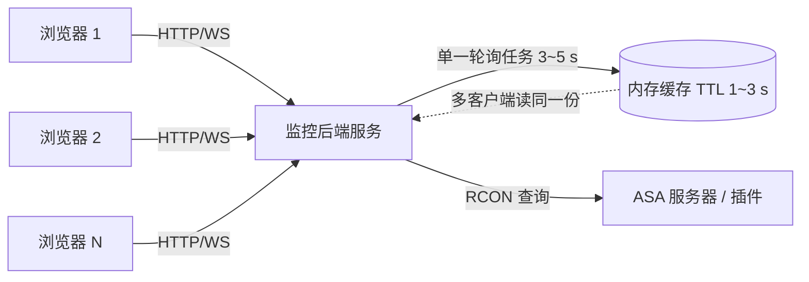

# 火山喷发状态查询 · 前端调用文档

> 插件：`TransferIdentityFixAPI` **v0.5.0** · 命令：`TransferIdentityFix.Volcano`
> 更新：2026-09-14 · 适用：Hass ASA Server Monitor 前端 / 任何 RCON 客户端

---

## 1. 一句话说明

一次 RCON 调用即可拿到**当前火山阶段 + 距下次事件倒计时**，数据来自游戏内常驻的喷发装置本体（不是统计拟合、不需要玩家在线）。

---

## 2. 命令与调用

```
TransferIdentityFix.Volcano             # 标准查询（JSON）
TransferIdentityFix.Volcano fresh       # 跳过响应缓存，强制重新读取
TransferIdentityFix.Volcano rescan      # 强制重新定位装置（仅调试用）
TransferIdentityFix.Volcano log         # 附带最近事件历史（喷发开始/结束）
```

- **通道**：RCON（标准 Source RCON，Type=2 发命令 → Type=0 收 JSON）
- **主机/端口/密码**：见《RCON接口与JSON数据结构说明.md》· 创世纪(Gen)＝32329
- **游戏内等价命令**：`/tif volcano`（聊天回显一行摘要，权限 `tif.viewer`）
- 参考实现：`TransferIdentityFixAPI/scripts/rcon_client.py`

```python
from rcon_client import send_rcon_command_sync
ok, payload = send_rcon_command_sync("work.whiterober.cn", 32329, "<密码>",
                                     "TransferIdentityFix.Volcano")
```

---

## 3. 返回字段全表

> 下面示例为实测结构（Gen 服）：

```json
{
  "ok": true,
  "phase": "idle",
  "class": "Volcanic_Eruption_Hazard_C",
  "actor": "Volcanic_Eruption_Hazard_C_0",
  "level": 1370,
  "between": 400,
  "lastEvent": 205889856,
  "elapsedSec": 587.2,
  "nextEventInSec": -187.2,
  "dueNow": 1,
  "anyEventActive": 0,
  "warmUpActive": 0,
  "playedEruption": 0,
  "playedCooldown": 1,
  "currentMatineeStartTime": 250,
  "maxFalseStarts": 2,
  "falseStartInt": 0,
  "lengthOfFalseStart": 0,
  "worldTimeSeconds": 205890443.2,
  "worldNow": 205890443.1,
  "cache": { "cached": 1, "scans": 3, "ageSec": 42.0,
             "cacheSeconds": 1, "rescanSeconds": 120, "recordSeconds": 1 }
}
```

| 字段 | 类型 | 前端语义 |
|---|---|---|
| `ok` | bool | `false` 时看 `error`（见 §7） |
| `phase` | string | **阶段**：`idle` 空转 / `warmup` 预热 / `eruption` 喷发中 / `cooldown` 冷却 |
| `class` / `actor` | string | 装置类名 / 实例名（诊断用，可忽略） |
| `level` | int | 装置所在关卡序号（世界共 1601 个流式关卡） |
| `between` | number | 本轮**事件间隔**（秒）。当前实测 **400**（DevKit 默认 800，以运行时为准） |
| `lastEvent` | number | **上次事件**发生的世界秒（`TimeLastEvent`） |
| `elapsedSec` | number | 距上次事件已过秒数 = `worldTimeSeconds − lastEvent` |
| `nextEventInSec` | number | **距下次事件**秒数 = `between − elapsedSec`。**负数 = 已过公式点** |
| `dueNow` | 0/1 | `1` = 已到点但尚未触发（存在前置条件门控，例如玩家在火山附近） |
| `anyEventActive` | 0/1 | 是否有事件正在进行（1 时建议显示“事件中”，隐藏倒计时） |
| `warmUpActive` | 0/1 | 是否处于预热（`warmup`）子阶段 |
| `playedEruption` | 0/1 | 本轮序列是否已播放“喷发”段 |
| `playedCooldown` | 0/1 | 本轮序列是否已播放“冷却”段 |
| `currentMatineeStartTime` | number | 当前 Matinee（演出）起始时间点（秒） |
| `maxFalseStarts` | number | 假喷发上限（实测 **2**，与“震1/震2=假喷发”吻合） |
| `falseStartInt` | number | 当前假喷发计数 |
| `lengthOfFalseStart` | number | 假喷发额外时长（实测 0 ⇒ 震本身就是表现） |
| `worldTimeSeconds` | number | **世界时钟**（权威时间基准，用于本地外推） |
| `worldNow` | number | GameState 复制时钟（玩家可见时间轴，可忽略） |
| `cache` | object | 见下表（性能诊断） |
| `hooks` | object | **事件钩子状态（诊断用，可忽略）**：`activate` / `deactivate`（1 = 钩子已挂上）、`events`、`inEvent`。⚠️ **实服证伪**：`AHazardTrigger::Activate/Deactivate` **不参与喷发循环**，`events` 恒为 `0` —— 喷发事件请改用 `history[]`（见 §4.1） |
| `history` | array | 仅在加 `log` 参数时返回：最近 64 条事件，每条 `{kind, cls, worldSec, durSec}`。`kind` ∈ `begin` / `end`（`TimeLastEvent` 变化边沿，**1 Hz 采样 ⇒ 精度 ±1 s**）/ `warmupOn` / `warmupOff` / `activeOn` / `activeOff`（对应标志位边沿）；`cls` = 触发事件的 hazard 类名；`durSec`：`begin` 为距上次开始的间隔，`end` 为本次持续时长 |

| `cache` 子字段 | 含义 |
|---|---|
| `cached` | 装置指针是否已缓存（1=命中） |
| `scans` | 累计重新定位次数（正常长期不增长） |
| `ageSec` | 距上次定位的秒数 |
| `cacheSeconds` | 响应 TTL（默认 1 s）—— 同窗口内的重复查询会**复用同一份 JSON** |
| `rescanSeconds` | 重扫限流（默认 120 s）—— 全关卡扫描的最低间隔 |
| `recordSeconds` | 事件记录器周期（默认 1 s；`0` = 关闭）。≥1 时**仅在 Gen** 每秒采样一次并写事件台账 |

---

## 4. ⭐ 推荐轮询架构（多客户端安全）

**必须知道的两条约束**

1. **RCON 命令在游戏线程上执行**（AsaApi 把 `UWorld*` 传进命令回调）⇒ 高频查询会挤占服务器主线程。
2. 插件侧已有 **1 秒 TTL 复用**：同一秒内的任意多个查询，只做一次真实读取。

**因此架构应为：后端单点轮询 + 前端读缓存**



| 层 | 职责 | 建议值 |
|---|---|---|
| **后端服务** | 唯一的轮询发起方；把结果写进内存缓存；对浏览器暴露 HTTP/WS | 轮询 **3~5 s** |
| **缓存** | 多客户端共享同一份数据；插件侧 1 s TTL 作为第二道保险 | TTL **1~3 s** |
| **浏览器** | 只做本地倒计时外推（§5），**不直接查 RCON** | 刷新 **1 s** |

> ⚠️ 切忌让每个浏览器各自直连 RCON：10 个客户端 × 1 次/秒 = 10 包/秒全部串行进游戏线程。

### 4.1 事件增量拉取（喷发开始 / 结束 / 地震）

服务端内有 **1 Hz 事件记录器**（`cache.recordSeconds`，默认 1，可配 `0` 关闭；**仅 Gen 地图运行**）：每秒读 3 个缓存字段（纯 `memcpy`，开销 < 1 微秒/秒），把边沿写入内存台账（最多 64 条）并同步写服务端日志：

- `TimeLastEvent` 变化 → `begin`（`durSec` = 距上次 `begin` 的间隔）
- `WarmUpActive` `0↔1` → `warmupOn` / `warmupOff`（**地震表现期**，实测持续 ≈ 98 s）
- `AnyEventActive` `0↔1` → `activeOn` / `activeOff`（实测喷发循环中**一直为 0**）

**推荐的增量拉取方式**

- 轮询里比对上次 `Volcano log` 返回的 `history[]` 末尾 `worldSec`；出现更大值 ⇒ 期间发生了新事件
- ⚠️ **不要**用 `hooks.events` 做增量判据 —— 实测该计数**恒为 0**（见 §3 `hooks` 说明）
- 台账精度为 **±1 s**（1 Hz 采样），帧级精确不可得：`AHazardTrigger::Activate/Deactivate` 钩子已实服证伪（挂得上，但不参与喷发循环）

**字段语义**

- `warmupOn` → `warmupOff` 的 `durSec` = **本段地震时长**（实测 ≈ 98 s）
- `begin.durSec` = 距上次 `begin` 的间隔（实测 ≈ **746 s**，即真实节拍）
- `between` 字段报的是 `TimeBetweenEvents`（实测 **400**），**不是真实节拍** —— 倒计时请以 `nextEventInSec` / 实测 `durSec` 为准，**不要**用 `between` 硬算

**其他约束**

- 台账前 **64 条**在插件内存中滚动保存；**插件重载 / 服务器重启会清空**（服务端日志 `VOLCANO_EVENT_*` 不受影响，可作长期留档）
- ⚠️ 插件**无法推送**（RCON 是请求-响应协议），前端仍需轮询

---

## 5. ⭐ 倒计时的正确实现（秒级视觉，低频查询）

**核心思路**：查询频率决定**数据新鲜度**；本地外推决定**显示平滑度**。两者解耦 —— 不要靠提高查询频率实现秒级刷新。

```js
// 后端每 3~5 秒轮询一次，把插件 JSON 透传给前端
let sync = null;

function onServerState(s) {
  const now = Date.now();
  sync = {
    worldSec: s.worldTimeSeconds,
    nextAt: s.worldTimeSeconds + (s.between - s.elapsedSec), // = worldSec + nextEventInSec
    localMs: now,
    phase: s.phase,
    active: s.anyEventActive === 1,
    dueNow: s.dueNow === 1,
  };
}

// 前端每 1 秒只做本地推算，不发任何请求
setInterval(() => {
  if (!sync) return;
  if (sync.active) { render("喷发进行中"); return; }

  const elapsed = (Date.now() - sync.localMs) / 1000;
  const worldNow = sync.worldSec + elapsed;
  const remain = sync.nextAt - worldNow;

  if (remain > 0)      render(`距下次事件 ${Math.floor(remain)} 秒`);
  else if (sync.dueNow) render("已到点，等待触发条件");
  else                  render("即将触发");
}, 1000);
```

> `nextEventInSec` 为**负数**时 `nextAt` 落在过去 —— 上面公式依然自洽（`remain` 为负 ⇒ 走“已到点”分支），无需特殊处理。

---

## 6. 阶段 → 显示建议

| `phase` | 建议显示 | 颜色 |
|---|---|---|
| `idle` | 空闲 · 倒计时进行中 | 灰 |
| `warmup` | **预热中**（地震表现期） | 黄 |
| `eruption` | **喷发中** | 红 |
| `cooldown` | 冷却中 | 蓝 |

**假喷发进度**：`falseStartInt / maxFalseStarts`（实测 0/2、最大值 2）—— 可用于显示“第 N 次假喷发（共 M 次）”。

---

## 7. 异常与边界处理

| 情况 | 返回 | 前端建议 |
|---|---|---|
| **非 Gen 地图**（写死闸门） | `{"ok":false,"error":"not a volcanic map","map":"<地图名>","expect":"Gen"}` | 显示“本图无火山事件”，而不是报错（**正常**） |
| Gen 上装置未加载 | `{"ok":false,"error":"hazard actor not found","filter":"...","scans":N,"worldTimeSeconds":...}` | 短暂重试；持续出现则排查装置是否存在于世界 |
| RCON 连接超时 | 无响应（客户端超时） | 显示“数据不可达”，指数退避重试 |
| `nextEventInSec ≤ 0` 且 `dueNow = 1` | 正常返回 | 显示“已到点，等待触发条件”（说明存在门控，不是错误） |
| **`lastEvent = 0` 且 `nextEventInSec = -1`** | 服务器**刚重启**，装置调度状态已归零（`TimeLastEvent` 不跨重启） | 显示“等待首次事件”，**不要**渲染负倒计时；待首次事件发生后自动恢复 |
| `cache.scans` 短时间内持续增长 | 装置指针反复失效 | 记日志排查；一般世界切换（换图）才会发生 |

---

## 8. 性能与并发说明

| 项目 | 数值 / 说明 |
|---|---|
| 单次查询成本（缓存命中） | 读 13 个字段，纯内存 `memcpy`，**微秒级** |
| 单次查询成本（缓存失效） | 触发全关卡扫描（1601 关卡 / 13.8 万 actor）—— 已被 `rescanSeconds`（默认 120 s）限流 |
| 插件侧 TTL | `cacheSeconds`（默认 **1 s**）⇒ 同秒内 N 个查询 = 1 次读取 |
| 插件常驻开销 | **≈0**：无查询时每秒仅 3 次字段读取（1 Hz 记录器，< 1 微秒/秒）；`volcano_record_seconds: 0` 可归零 |
| 建议查询频率 | **每服 3~5 秒一次**（由后端单一任务发起） |

**配置项**（`ArkApi/Plugins/TransferIdentityFixAPI/config.json`）

```json
"volcano_actor_filter": "Volcanic_Eruption_Hazard",
"volcano_rescan_seconds": 120,
"volcano_cache_seconds": 1,
"volcano_record_seconds": 1
```

- `volcano_cache_seconds` 调大可进一步降低读取频率（但会降低新鲜度）；设为 `0` 关闭复用。
- `volcano_record_seconds` 设 `0` 可完全关闭事件台账（省掉那 1 Hz 采样）；默认 `1` 即可。
- 前端用 `fresh` 参数可绕过 TTL（**不建议在轮询中使用**）。
- ⚠️ **地图闸门已写死为 `Gen`（不提供配置项）**：非创世纪地图上 `Volcano` / `/tif volcano` / `HazardProbe` 一律返回 `not a volcanic map`，且**事件记录器完全不运行**（该服日志不会出现任何 `VOLCANO` 行）。

---

## 9. 多服务器

每个地图是独立服务器、独立 RCON 端口，**分别查询**（前端可并行）：

| 地图 | 缩写 | 端口 |
|---|---|---|
| 孤岛 | Isl | 32320 |
| 焦土 | Sco | 32321 |
| 中心岛 | Cen | 32322 |
| 艾伯 | Abe | 32323 |
| 灭绝 | Ext | 32324 |
| 仙境 | Ast | 32325 |
| 拉格纳 | Rag | 32326 |
| 瓦尔盖罗 | Val | 32327 |
| 迷失 | Los | 32328 |
| 创世纪2 | Gen | 32329 |

> 火山相关命令**已写死只在 Gen 生效**（硬编码，不提供配置项）；其它地图调用返回 `{"ok":false,"error":"not a volcanic map","map":"...","expect":"Gen"}`，且插件在那些图上不做任何火山工作。

---

## 10. 联调自查清单

1. 单次调用返回 `ok:true` 且 `class` 为 `Volcanic_Eruption_Hazard_C` ✅
2. 连续两次调用（间隔 <1 s）→ 返回内容完全一致（TTL 复用在起作用）✅
3. 加 `fresh` 再调 → `worldTimeSeconds` 应前进 ✅
4. 后端轮询 5 s、浏览器倒计时 1 s 刷新 → 倒计时逐秒递减且不跳变 ✅
5. 多开 10 个浏览器页面 → 服务器日志中 `VOLCANO` 行数**仍是每 3~5 秒 1 条**（而非 10 倍）✅
6. `hooks.activate=1` / `hooks.deactivate=1` → 钩子已挂上（**但 `hooks.events` 恒为 0，属已知现象，不影响事件捕获**）✅
7. 用 `Volcano log` 查历史：服务端日志按 `VOLCANO_EVENT warmupOn → begin → warmupOff` 成序列出现；`begin.durSec` = 距上次开始的间隔（实测 ≈746 s），`warmupOff.durSec` ≈ 地震时长（实测 ≈98 s）✅
8. 在非 Gen 服务器调用 → 返回 `not a volcanic map`（写死闸门生效），且该服日志**无任何 `VOLCANO` 行** ✅

---

## 附：字段来源（便于排障）

| 字段 | 游戏侧属性 |
|---|---|
| `between` | `TimeBetweenEvents` |
| `lastEvent` | `TimeLastEvent` |
| `anyEventActive` / `warmUpActive` | `AnyEventActive` / `WarmUpActive` |
| `playedEruption` / `playedCooldown` | `PlayedEruption` / `PlayedCooldown` |
| `maxFalseStarts` / `falseStartInt` / `lengthOfFalseStart` | `MaxFalseStarts` / `FalseStartInt` / `LengthOfFalseStart` |
| `currentMatineeStartTime` | `CurrentMatineeStartTime` |
| `worldTimeSeconds` | `UWorld.TimeSeconds`（持久世界时钟，1:1 于现实秒） |

> 装置本体：`/Game/Genesis/CoreBlueprints/Environment/Hazards/Volcanic/Eruption/Volcanic_Eruption_Hazard`
> —— 常驻世界（实测位于第 1370 号流式关卡），通过 `Activate/Deactivate` 切换状态，**不会自毁**。
