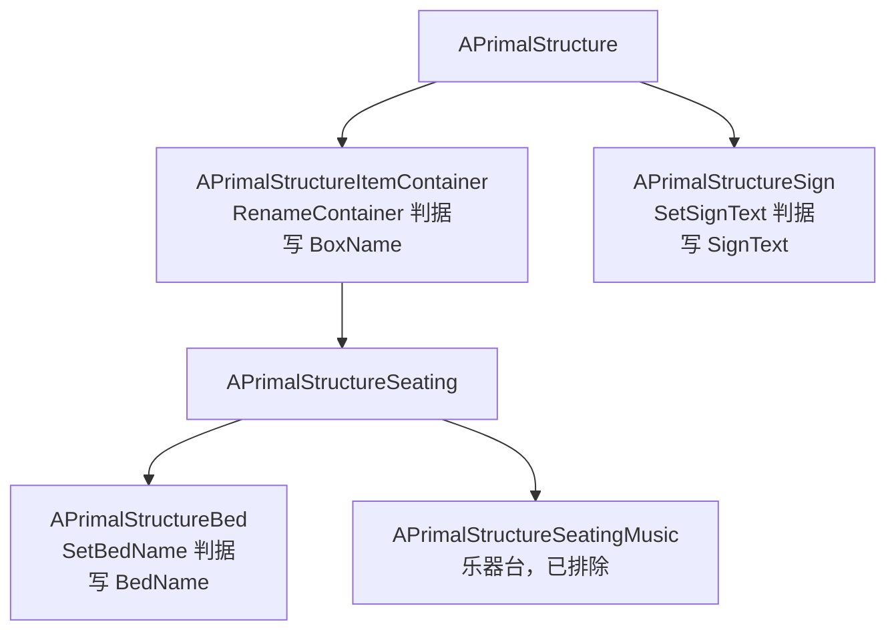

# 设施文字与改名命令 — 前端调用文档（交接单）

> 日期：**2026-09-19**
> 适用版本：`TransferIdentityFixAPI.dll` **1,546,240 B**（插件回报 `version 0.4.0`）
> 影响面：**新增 2 个 RCON 命令** + **1 个已有命令增强**（`-` 清空）+ **1 处重要字段口径修正**
> 全部**向后兼容**，旧字段 / 旧命令不变。
> 详细接口参考同步更新于 `ASA Transfer Identity Fix\接口文档\RCON接口与JSON数据结构说明.md` §3.7 ~ §3.10。

---

## 零、一句话结论（先看这段）

> **「给设施写文字」现在有 3 条命令，按设施类型分派，不能乱用。**

| 你想改的东西 | 用哪条命令 | 实际写的字段 | 客户端会立刻变吗 |
|---|---|:---:|:---:|
| **容器箱**（`StorageBox_*`、冰箱 `CryoFridge`、`IceBox`、`PreservingBin`…） | `RenameContainer` | `BoxName` | ✅ **会** |
| **牌子 / 墓碑**（`Sign_*`、`HangingSign*`、`Gravestone_*`） | `SetSignText` | `SignText` | ❌ 需重进视野 / 重连 |
| **床 / 棺材 / 睡眠舱**（`SimpleBed`、`Coffin_*`、`SleepingPod*`） | `SetBedName` | `BedName` | ❌ 需重进视野 / 重连 |

**清空**：三条命令统一传单个半角 `-`。

---

## 一、⚠️ 最重要的一条修正：别再拿 `RenameContainer` 改床 / 棺材

### 之前的问题
旧版用 `RenameContainer` 改床 / 棺材，接口**返回 `ok:true` 看似成功**，但**游戏内名字纹丝不动**。

### 根因（2026-09-19 Sco 实服已证实）
`RenameContainer` 写的是 **`BoxName`**，而**床 / 棺材这个设施族游戏根本不读 `BoxName`**。

**判据（铁证）**：用新命令 `SetBedName` 去**读** Sco 的床与棺材，读出的原值是：

| 对象 | `BedName` 原值 |
|---|---|
| `SimpleBed_C_2147020656` | **「蓝蓝」** |
| `StructureBP_Coffin_Upright_C_2144510530` | **「焦土号棺材」** |

→ 这两个**正是玩家自己在游戏里起的名字**，说明 `BedName` 才是这一族的权威字段。

### 类层次（解释为什么必须分成三条命令）



> ⚠️ 注意 `APrimalStructureSign` **同时也是床 / 棺材的基类** —— 所以单纯「类型判断通过」不足以确认目标；
> 三条命令都在类型判断**之外额外加了类名白名单**，因此把牌子 ID 传给 `SetBedName` 之类会被**安全拒绝**（不会写坏内存）。

---

## 二、`RenameContainer`（容器箱改名）

```
TransferIdentityFix.RenameContainer <objName|尾部数字> <新名字>
```

### 参数

| 参数 | 说明 |
|---|---|
| `objName` | 容器持久对象名，如 `StorageBox_Barrel_C_2146633556`；也可**只传尾部实例数字**（≥4 位），如 `2146633556` |
| `新名字` | **可含空格**（整体作为名字）；≤ **60 UTF-8 字节**（约 20 汉字）；不含控制字符。<br>**传 `-` 表示清空** |

### 成功返回

```json
{"ok":true,"objName":"CryoFridge_C_2143602189","class":"CryoFridge_C","field":"BoxName",
 "old":"焦土常用","new":"TIF-TEST-01","readback":"TIF-TEST-01","verified":true,"dup":1,
 "detail":"objName=CryoFridge_C_2143602189 class=CryoFridge_C old=焦土常用 new=TIF-TEST-01 readback=TIF-TEST-01 verified=1 dup=1"}
```

| 字段 | 含义 |
|---|---|
| `objName` | 命中容器的持久名（**可直接回传用于后续调用**） |
| `class` | 完整类名 |
| `field` | 恒为 `"BoxName"` |
| `old` / `new` | 改动前 / 目标名字 |
| `readback` | 写入后**回读**到的值 |
| `verified` | `readback == new`。建议**以 `ok:true` 为准**；`verified:false` 表示回读不一致（异常情况） |
| `dup` | 与新名字**同名**的容器数量（含自身，≥1 属正常；>1 提示可能重名） |
| `detail` | 人类可读摘要（供只解析文本的旧逻辑使用） |

### 🆕 `-` 清空（本次新增）

```
TransferIdentityFix.RenameContainer 2144510530 -
```
```json
{"ok":true,"objName":"StructureBP_Coffin_Upright_C_2144510530","class":"StructureBP_Coffin_Upright_C",
 "field":"BoxName","old":"-","new":"","readback":"","verified":true,"dup":408}
```

> 这是**唯一的清空手段** —— RCON 按空格切词，无法传空参数。
> 旧逻辑若曾误把 `-` 当普通名字写入，现在可以用同一条命令把它清回空。

### 失败返回

```json
{"ok":false,"error":"container not found","id":"999",
 "hint":"this id belongs to a non-container structure (Sign_Wall_Metal_C); only container boxes can be renamed",
 "detail":"container not found id=999; this id belongs to a non-container structure (Sign_Wall_Metal_C); only container boxes can be renamed"}
{"ok":false,"error":"ambiguous id (2 matches)","detail":"ambiguous id (2 matches) id=1234"}
{"ok":false,"error":"name empty","detail":"name empty"}
{"ok":false,"error":"name too long (61 bytes, max 60)","detail":"name too long (61 bytes, max 60)"}
{"ok":false,"error":"name contains control char","detail":"name contains control char"}
{"ok":false,"error":"usage: RenameContainer <objName|instanceSuffix> <new name>"}
```

---

## 三、`SetSignText`（牌子 / 墓碑写文字）

```
TransferIdentityFix.SetSignText <objName|尾部数字> <文字>
```

> 覆盖 **牌子**（`Sign_Small/Wall/Large_*`、`StructureBP_HangingSign*`）与 **墓碑**（`StructureBP_Gravestone_*`）。
> **不含床 / 棺材**（走 `SetBedName`）。

### 成功返回

```json
{"ok":true,"objName":"Sign_Wall_Metal_C_2145949196","class":"Sign_Wall_Metal_C","field":"SignText",
 "old":"afdafasfdadfsafhgcxvbxc","new":"TIF-SIGN-REG","readback":"TIF-SIGN-REG","verified":true,"maxChars":160,
 "clientRefresh":"re-enter range or reconnect (no official net RPC for SignText)",
 "detail":"objName=Sign_Wall_Metal_C_2145949196 class=Sign_Wall_Metal_C old=afdafasfdadfsafhgcxvbxc new=TIF-SIGN-REG readback=TIF-SIGN-REG verified=1 maxChars=160"}
```

| 字段 | 含义 |
|---|---|
| `field` | 恒为 `"SignText"` |
| `old` / `new` / `readback` | 原文字 / 新文字 / 写后回读 |
| **`maxChars`** | **该牌子能容纳的最大字符数**（读自游戏字段，牌子 / 墓碑实测 `160`）。<br>⚠️ **按 Unicode 码点计**（不是字节），中文按 1 字算。`0` = 该对象未暴露该字段（不校验） |
| **`clientRefresh`** | 固定提示串：`SignText` **无官方 net-sync RPC**，客户端需**重进视野或重连** |

### 失败返回

```json
{"ok":false,"error":"sign not found","id":"2147020656",
 "hint":"this id belongs to a non-sign structure (SimpleBed_C); only signs and gravestones can take text",
 "detail":"sign not found id=2147020656; this id belongs to a non-sign structure (SimpleBed_C); only signs and gravestones can take text"}
{"ok":false,"error":"text too long","detail":"text too long chars=161 max=160"}
{"ok":false,"error":"text empty","detail":"text empty"}
{"ok":false,"error":"ambiguous id (2 matches)","detail":"ambiguous id (2 matches) id=1234"}
{"ok":false,"error":"usage: SetSignText <objName|instanceSuffix> <text>"}
```

### ⚠️ RCON 单包长度上限（前端必须自己截断）

超长文字**不会**返回 `text too long`，而是**完全没有响应**（客户端表现为 `no response`）。

| 命令长度 | 结果 |
|---|---|
| 160 字符 | ✅ 正常返回 |
| 161 / 200 / 300 字符 | ✅ 正常返回 `text too long`（说明命令本身送到了） |
| **543 字节** | ❌ **无响应**（超过 RCON 单包上限） |

> **前端要求**：先按 `maxChars` 自行截断，并保证**整条命令 ≤ 300 字节**。

---

## 四、`SetBedName`（床 / 棺材 / 睡眠舱改名）🆕

```
TransferIdentityFix.SetBedName <objName|尾部数字> <名字>
```

> 覆盖 **床**（`SimpleBed`、`ModernBed`…）、**棺材**（`StructureBP_Coffin_*`）、**睡眠舱**（`SleepingPod*`）。
> **显式排除乐器台**（`SeatingMusic`，与床共享基类）。

### 成功返回

```json
{"ok":true,"objName":"SimpleBed_C_2147020656","class":"SimpleBed_C","field":"BedName",
 "old":"蓝蓝","new":"TIF-BED-01","readback":"TIF-BED-01","verified":true,
 "clientRefresh":"re-enter range or reconnect (no official net RPC for BedName)",
 "detail":"objName=SimpleBed_C_2147020656 class=SimpleBed_C old=蓝蓝 new=TIF-BED-01 readback=TIF-BED-01 verified=1"}
```

| 字段 | 含义 |
|---|---|
| `field` | 恒为 `"BedName"` |
| `old` / `new` / `readback` | 原名 / 新名 / 写后回读 |
| **`clientRefresh`** | 固定提示串：`BedName` **无官方 net-sync RPC**，客户端需**重进视野或重连** |

**名字限制**：非空、≤ **60 UTF-8 字节**（约 20 汉字）、不含控制字符。传 `-` **清空**。

### 失败返回

```json
{"ok":false,"error":"bed not found","id":"2145949196",
 "hint":"this id belongs to a non-bed structure (Sign_Wall_Metal_C); only beds, coffins and sleeping pods can be renamed here",
 "detail":"bed not found id=2145949196; this id belongs to a non-bed structure (Sign_Wall_Metal_C); only beds, coffins and sleeping pods can be renamed here"}
{"ok":false,"error":"name too long (61 bytes, max 60)","detail":"name too long (61 bytes, max 60)"}
{"ok":false,"error":"name empty","detail":"name empty"}
{"ok":false,"error":"ambiguous id (2 matches)","detail":"ambiguous id (2 matches) id=1234"}
{"ok":false,"error":"usage: SetBedName <objName|instanceSuffix> <name> (- to clear)"}
```

---

## 五、💡 前端自动纠错建议（强烈推荐实现）

三条命令的失败返回里，**`hint` 字段都会回带「目标的实际类名」**。前端可据此自动重试，无需人工判断：

```
1. 先按设施大类猜测命令（或由用户选择）
2. 调用 → 若 ok:false 且 error 是 xxx not found
3. 从 hint 中正则取括号里的类名，例如 (Sign_Wall_Metal_C) / (SimpleBed_C) / (StorageBox_Large_C)
4. 重新映射：
     类名含 Sign / Gravestone      → SetSignText
     类名含 Bed / Coffin / SleepingPod → SetBedName
     其他                          → RenameContainer
5. 用正确命令重试一次
```

> 这样前端**不需要维护一份完整的类名清单**，改错命令也能自愈。

---

## 六、实服验证记录（2026-09-19，Sco）

**18 项测试全部通过，0 失败**：

| 组 | 内容 | 结果 |
|---|---|:---:|
| A | 功能测试 7 项（`DinoMutPing` / `SetBedName`×3 / `SetSignText` / `RenameContainer` 清空×3） | 7/7 ✅ |
| B | 白名单边界 3 项（容器→`SetBedName` 拒、床→`SetSignText` 拒、墓碑→`SetBedName` 拒） | 3/3 ✅ |
| C | 数据还原 4 项（牌子 / 床 / 棺材还原原值、墓碑保持空） | 4/4 ✅ |

- 拒绝路径**均正确回带实际类名**：`bed not found ... (StorageBox_Large_C)`、`sign not found ... (SimpleBed_C)`
- 插件版本回报：`{"ok":true,"plugin":"TransferIdentityFixAPI","version":"0.4.0"}`
- 测试写入的临时值**已全部还原**，实服无残留

---

## 七、行为限制（非缺陷，前端需知）

| 项 | 说明 |
|---|---|
| **客户端刷新** | `RenameContainer`（`BoxName`）**有官方 net RPC → 即时刷新**；<br>`SetSignText`（`SignText`）与 `SetBedName`（`BedName`）**无官方 net RPC → 客户端需重进视野或重连**。<br>服务端值**立即写入**，且**下次自动存档后持久化**（重启不丢） |
| **服务端权威** | 写入的是**服务端权威字段**，离线存档 dump / 读档工具**立即**能看到新值（不受客户端滞后影响） |
| **同名重名** | 容器改名返回 `dup` 提示同名数量；牌子 / 床无重名检查 |
| **ID 定位** | 三条命令均支持「完整持久对象名」或「尾部实例数字（≥4 位）」。<br>尾部数字**同时匹配多个**结构时返回 `ambiguous id (N matches)`，此时请改用完整名 |
| **持久名会变** | 设施改名**不会**改变其持久对象名（`objName`），可放心复用 |

---

## 八、完整可复制调用示例（Python）

```python
import sys
sys.path.insert(0, r"b:\项目\ASA Transfer Identity Fix\TransferIdentityFixAPI\scripts")
from rcon_client import send_rcon_command_sync

HOST, PORT, PWD = "work.whiterober.cn", 32321, "<RCON密码>"

def call(cmd):
    ok, payload = send_rcon_command_sync(HOST, PORT, PWD, cmd, timeout=25)
    return payload

# 容器箱改名（客户端即时刷新）
call("TransferIdentityFix.RenameContainer 2143602189 焦土常用")

# 牌子写文字（160 字上限）
call("TransferIdentityFix.SetSignText 2145949196 欢迎来到焦土")

# 床改名
call("TransferIdentityFix.SetBedName 2147020656 蓝蓝的床")

# 全部清空
call("TransferIdentityFix.RenameContainer 2143602189 -")
call("TransferIdentityFix.SetSignText 2145949196 -")
call("TransferIdentityFix.SetBedName 2147020656 -")
```

> ⚠️ **RCON 密码属敏感信息**，前端应放在**服务端配置**中，不得写入前端代码或日志。
