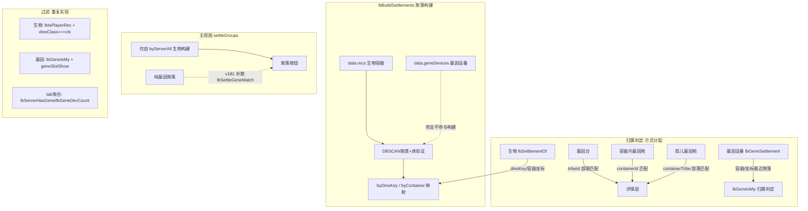
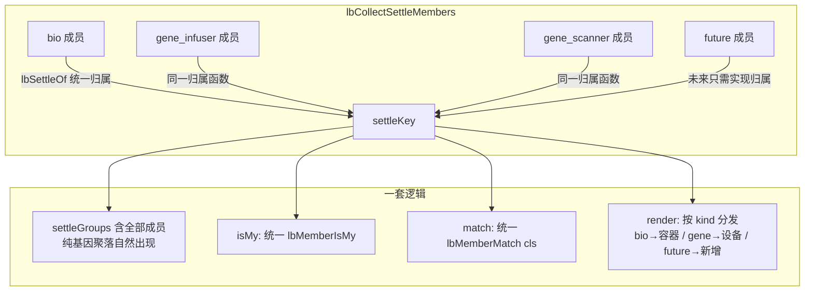

# 统一聚落分组逻辑 — 实施计划

> 版本：v1.0（2026-08-14）
> 状态：📋 已分析，待实施
> 目标：统一聚落分组逻辑（不区分球 / 基因 / 未来的新东西）

---

## 一、背景与目标

当前 `dino-import-new.html`（最新生物导入）中，聚落分组由「生物」（低温仓 rec）驱动，基因设备（geneDevices）是"外来者"，导致：

1. **归属方式分裂**——生物、基因台、基因枪各自用不同方式归属聚落，同一实体"归属聚落"与"判定是否我的"可能不一致
2. **settleGroups 不含基因**——纯基因聚落不出现，被迫用 `lbSettleGeneMatch` 补救
3. **过滤重复实现**——玩家过滤、物种过滤在生物/基因两套逻辑里各写一遍
4. **未来实体无入口**——新增设施需重写归属/过滤/渲染/计数

**目标**：引入「聚落成员（SettleMember）」统一抽象，一套归属、一套过滤、一套分组、一套渲染分发，未来新实体只需实现 3 个点即可接入全部功能。

---

## 二、现状架构（5 层逻辑）



### 关键函数清单

| 层 | 函数 | 位置 | 职责 |
|----|------|------|------|
| 数据 | `lbBuildSettlements` | ~2191 | 由 recs+structures 构建聚落（byDinoKey/byContainer/byServer） |
| 数据 | `lbEnsureSettlements` | ~2517 | 幂等构建缓存 |
| 归属 | `lbSettlementOf` | ~2556 | 生物归属聚落（dinoKey→容器坐标） |
| 归属 | `lbGeneSettlement` | ~3966 | 基因设备归属聚落（容器→坐标最近聚落） |
| 归属 | `lbGeneIsMy` | ~3990 | 基因设备"我的"判定（聚落冠名→部落回退） |
| 分组 | `lbRenderView` settleGroups | ~3560 | 仅生物构建聚落按钮结构 |
| 分组 | `lbClusterSettles` | ~3640 | 聚落按钮匹配子集/计数 |
| 分组 | `lbSettleGeneMatch` | ~3630 | **v181 补救**：聚落有匹配基因则保留按钮 |
| 详情 | `lbBuildSettleContainerHtml` | ~4070 | 容器分组 + 基因台/容器枪/孤儿容器 |
| 过滤 | `lbIsPlayerRec` / `lbPlayerTribes` | ~2542 | 生物玩家过滤 |
| 过滤 | `lbServerHasGene` / `lbGeneDevCount` | ~3400 | tab 基因统计（v180 按玩家） |

---

## 三、统一方案设计

### 3.1 核心抽象：SettleMember

```js
// 所有可归属聚落的实体统一为成员
SettleMember = {
  kind: 'bio' | 'gene_infuser' | 'gene_scanner' | '<future>',
  item: <原始数据>,
  server,
  settleKey: '<聚落key> | nosettle | scattered',  // 统一归属
  tribeId,
  isMy,       // 统一玩家判定
  match(cls), // 统一物种匹配
  render()    // 详情渲染（按 kind 分发）
}
```



### 3.2 统一归属

- 生物：保留 `lbSettlementOf`（dinoKey / 容器坐标）✅
- 基因设备：**并入 `lbBuildSettlements`**——基因台坐标、基因枪容器作为"成员容器"参与归属；`byContainer` 覆盖基因枪容器；基因台用坐标→最近聚落中心
- 收益：删除 `lbSettleGeneMatch` 补救；`lbGeneSettlement` 与详情展示归属一致

### 3.3 统一过滤

- 玩家：`lbMemberIsMy(member)` —— 内部按 kind 分发到 `lbIsPlayerRec` / `lbGeneIsMy`
- 物种：`lbMemberMatch(member, cls)` —— 生物 `dinoClass` / 基因 `geneSlotShow`

### 3.4 统一分组与渲染

- `settleGroups` 由 `lbCollectSettleMembers` 构建（不再只吃生物）
- `lbBuildSettleContainerHtml` 按 `kind` 分发渲染
- tab 存在性 / 🧬 计数 / 自动展开 / 空按钮隐藏 全部走成员统一计数

### 3.5 未来扩展

新增实体实现 3 点即自动接入：`settleOf(item)` + `match(item, cls)` + `render(item)`

---

## 四、分阶段实施计划

### 阶段 1：基因设备并入聚落归属（低风险）— ✅ 2026-08-14 v182 完成

- [x] 1.1 `lbBuildSettlements` 纳入基因设备容器 —— **跳过**（`lbGeneSettlement` 坐标归属已覆盖孤儿容器，避免动核心构建）
- [x] 1.2 统一归属：`lbGeneSettlement` 加 scattered 兜底（坐标无归属→离散），生物/基因统一坐标归属策略
- [x] 1.3 `lbSettleGeneMatch` 改为统一归属（坐标归属==聚落 OR 部落兜底），函数保留
- [x] 1.4 详情层 `geneInSettle`：基因台/孤儿容器按坐标归属匹配（部落兜底）
- [x] 1.5 回归验证通过（选物种聚落按钮/全部物种计数/详情分组/玩家 tab 统计）

### 阶段 2：SettleMember 抽象重构（中风险）— ✅ 2026-08-14 v183 完成（界面不变）

- [x] 2.1 新增 `lbCollectSettleMembers(server)`：收集 bio / gene_infuser / gene_scanner 成员（统一归属，玩家模式按 lbIsPlayerRec 过滤 bios）
- [x] 2.2 `settleGroups`（生物）+ `LB._geneGroups`（基因）统一构建，纯基因聚落自然出现
- [x] 2.3 统一过滤接口 `lbMemberIsMy` / `lbMemberMatch`
- [x] 2.4 详情渲染从 `LB._geneGroups` 按 kind 取（bio→容器 / gene→设备），删除 geneInSettle/gd 遍历
- [x] 2.5 tab 聚合（lbServerHasGene/lbGeneDevCount）保持 v180 按玩家（功能等价，未额外改动）
- [x] 2.6 按钮层 it.settle 统一归属 + 离散点含基因坐标；删除 lbSettleGeneMatch

### 阶段 3：未来实体接入验证 — ✅ 2026-08-14 v184 全场景回归完成

- [x] 3.1 新实体实现 settleOf/match/render 即接入（框架已就绪，未来实体预留）
- [x] 3.2 全场景回归（玩家模式/全部物种/选物种/离散/放出/背包/tab统计/详情分组/autoOpen）——板板数据无离散聚落（代码路径保持），其余全部通过

---

## 五、风险与边界

| 项 | 说明 |
|----|------|
| 基因台归属 | 只有 x/y 坐标 → 统一"坐标→最近聚落中心"，与 `lbGeneSettlement` 一致，低风险 |
| 孤儿容器 | 有 containerX/Y + containerTribe → 统一坐标归属，需验证与部落匹配一致性 |
| 玩家背包 | 特殊实体 `kind:'backpack'`，排除出聚落（独立 tab） |
| 放出 released | 特殊容器（rel_ 合成 id）保持现状 |
| 改动量 | 阶段 1 涉及 `lbBuildSettlements` 需回归；阶段 2 为重构，需全场景测试 |

---

## 六、验证清单

- [ ] `node --check` 语法通过
- [ ] 全部物种：聚落按钮计数正确（补给车厢 2/39 等）
- [ ] 选物种：聚落按钮含基因保留 + 🧬 标记
- [ ] 纯基因聚落：按钮出现 → 详情基因设备自动展开
- [ ] 玩家模式：基因统计只算板板的（繁星/瓦尔盖罗 tab 消失）
- [ ] 详情：生物容器 / 基因台 / 容器枪 / 孤儿容器分组正确
- [ ] 浏览器实页 + 预览区双端渲染一致

---

## 七、相关文件

| 文件 | 说明 |
|------|------|
| `dino-import-new.html` | 唯一前端文件（~360KB，内联 JS），部署到 `/config/www/dino-import.html` |
| 备份目录 | `bak/dino-import-new_backup_v*.html` |
| 进度文件 | `c:\Users\white\.copilot\进度\011_开发_最新生物TAB实施.md` |
