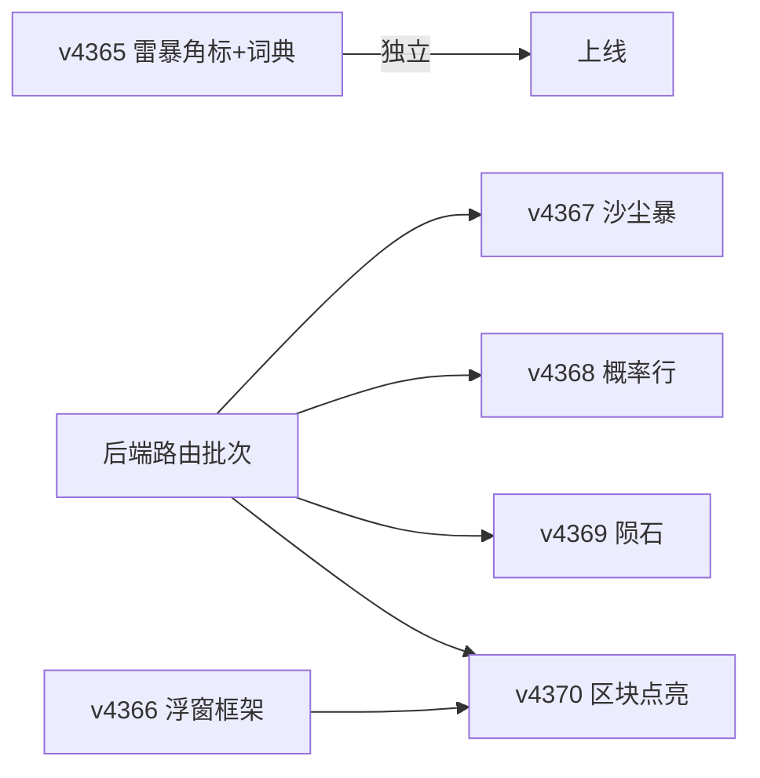

# WorldProbe 全服事件对接 · 落地实施计划（2026-10-06）

> **依据（唯一真源）**：
> - `报告\方案_WorldProbe完整对接_前后端_20261006.md`（v3：§1 矩阵 / §2 后端设计 / §3 沙尘暴 / §4 巨浪 / §9 概率 / §10 浮窗）
> - `报告\WorldProbe_全服事件对接文档_20261006.md`（插件实测：§14 Rag 沙尘暴 / §15 雪崩 / §16 巨浪 / §17 雷暴全图 / §18 Los 权重）
> **本计划 = 可执行拆解**：批次 → 步骤（复选框）→ 📁 涉及文件 → 验收断言 → 完成判据。执行时逐项勾选。
> 三环链路：**插件 dll（命令）→ 后端 `独立后端\dino_backend.py`（HTTP 路由）→ 前端 `dino-import.html`（显示）**
> 📌 **执行记录（2026-10-06 v4374 收尾）**：P1~P7 已全部实际交付（顺位：v4365 雷暴角标+词典 → v4366 Sco 雷暴独立卡 → v4367 沙尘暴独立卡+后端 6 路由 → v4368 概率行 → v4369 陨石卡 → v4370 浮窗化全套 → v4371~v4374 热修/改名）；本文件复选框已按实际交付勾选，形态演进注记见各行。P8 badwx 待开发。

---

## 0. 基线状态（开工前核验，2026-10-06）

| 项 | 当前状态 | 核验方法 |
|---|---|---|
| 前端线上版本 | **v20261004-4364**（CF Version `f49b5201-…`） | PW 读 `window.LB_VERSION` |
| 插件 dll 覆盖 | **Rag 已 v122b4**（`build = Oct 6 12:58:34`）；其余 9 图 = v122b2（`01:50:26`） | `DinoMutPing` 读 `build` |
| 后端真身 | `\\SERVER\dino_backend\dino_backend.py`（10-04 版，**无任何新路由**） | POST 不带 `username` → 401=路由存在 / 404=不存在 |
| 词典现状 | Superheat=极热×3、Foggy=雾天×2、Clear_Skies=晴天×2、ClearSky=晴空×3、ClearSkyV2=晴空 V2×4；Overcast/Spooky/ClearSkyV3/MeteorRain **无键** | `tmp\_dict_probe.py` |
| 进度文件 | `c:\Users\white\.copilot\进度\051_开发_单一物品主体页优化.md`（步骤 202） | — |

### 0.1 与方案 §6 的两处口径对齐（本计划生效）

1. **序 3「v4366 巨浪卡」已被 v3 修订架空**——§4.2/§4.3 已把巨浪并入 §10「生态圈事件」浮窗 ⇒ **v4366 顺位改放「浮窗框架」**（§10.6 纯前端部分提前；理由：无后端依赖可立即做，且巨浪/流星雨/火山区块都需要先有容器）。
2. **序 7「Rag 火山 / Gen 流星雨 / badwx 待排」** ⇒ 前两者**并入 v4370 分批点亮**（它们就是 §10 浮窗的数据区块）；badwx 作可选批 P8。

---

## 1. 批次总览与依赖

| 批次 | 交付 | 依赖 | 版本 | 阻塞点 |
|---|---|---|---|---|
| **P1** | 雷暴区域名角标 + 词典修订（§9.6 全清单） | 无 | **v4365** | 无（可立即开工） |
| **P2** | 后端路由批次（weather 升级 + wave/sandstorm/meteor/actor/badwx + wprobs） | 无（本地改码） | `dino_backend.py` | **用户侧上传+重启** |
| **P3** | 浮窗框架（三图改名 + 壳 + 文案区块 + 现有迁移） | 无 | **v4366** | 无（可立即开工） |
| **P4** | Rag 沙尘暴落位（角标 + 说明行） | P2(sandstorm)；Rag dll ✅已覆盖 | **v4367** | P2 |
| **P5** | 全服天气概率行 | P2(wprobs) | **v4368** | P2 |
| **P6** | Ext 陨石预警（phase 四态） | P2(meteor) | **v4369** | P2 |
| **P7** | 浮窗区块点亮：巨浪 + 流星雨 + Rag 火山 | P2(wave/actor) + P3 | **v4370** | P2 + P3 |
| **P8** | 坏天气权重因子（可选） | P2(badwx) | 待排 | 可选 |

---

## 2. 批次 P1 · v4365（纯前端，无依赖）

### P1-1 词典修订（方案 §9.6 全清单，2026-10-06 用户定稿）

- [x] **改值 5 项**：`Superheat` 极热→**焚风** ｜ `Foggy` 雾天→**雾** ｜ `Clear_Skies` 晴天→**晴** ｜ `ClearSky` 晴空→**晴** ｜ `ClearSkyV2`/`ClearSky_V2` 晴空 V2→**晴²**（上标 U+00B2）｜ `Partly_Cloudy` 晴间多云→**晴转多云**
  - 📁 改动位置：`dino-import.html` `LB_WX_ZH`（L21355 附近）+ `汉化\weather_zh.json`；`TOK`（L21394 附近）中 `Superheat:'极热'→'焚风'`、`Partly:'晴间'→'晴转'`、`ClearSky:'晴空'→'晴'`
- [x] **新增键 4 项**：`Overcast`→**阴** ｜ `Spooky`→**晦** ｜ `ClearSkyV3`→**晴³**（U+00B3）｜ `MeteorRain`→**陨石雨**（与 Gen 月球 `MeteorShower`「流星雨」**严格区分，不得混用**）
  - 📁 `dino-import.html` `LB_WX_ZH` + `汉化\weather_zh.json`
- [x] **前缀剥离**：`lbWxNameZh` 增加剥 `WeatherPreset_` / `DA_WeatherPreset_` 后再走查询链（Ast/Rag/Val/Los 预设名带前缀，否则概率行显英文）
  - 📁 `dino-import.html` `lbWxNameZh` 函数（L21400 附近，grep 定位）
- [x] **词典复核**：`tmp\_dict_probe.py` 复测 → 旧值 0 残留、新键全命中；`lbWxNameZh('WeatherPreset_RAG_Sandstorm')`=沙尘暴、`('WeatherPreset_LC_ClearSkyV3')`=晴³
  - 📁 `tmp\_dict_probe.py`（复用）

### P1-2 雷暴区域名角标（方案 §5.1）

- [x] **新增 `lbWxEsRegion()`**：读 `wxSemantics.electricalStorm.regionNameProbe.asString`（string / `.asString` 双兼容 + 白名单净化 `[A-Za-z0-9_\- ]`；空/无雷暴返回 `''`）
  - 📁 `dino-import.html`（新函数，放 `lbWxNameZh` 附近）
- [x] **角标追加**：v4344 雷暴角标文案「⚡ 全图雷暴」→ 有区域名时「⚡ 全图雷暴 · 区域：Center」（仅图层角标，**不进**面板卡）
  - 📁 `dino-import.html` `lbWxStormOverlay` 雷暴分支（grep「⚡ 全图雷暴」定位）
- [x] **PW 验收**：无雷暴 → 角标零残留；注入构造（`LB._wxz` 注入法）→ 角标含「· 区域：X」；Isl/Gen 等图零残留
- [x] **收尾**：改码脚本 `node --check` 门禁 → `LB_VERSION` v4365 + `pwa/sw.js` 同步 → `tmp\_deploy_cf.py` 部署 → PW 清缓存验证 → 进度+记忆

---

## 3. 批次 P2 · 后端路由（`独立后端\dino_backend.py`）

> 部署流程：本地改 → 上传物理服务器 `\\SERVER\dino_backend\dino_backend.py` → **用户侧**运行 `restart_dino_backend.bat`。验证：POST 不带 `username` → 401=路由存在；带 UA 的 Python/curl 断言关键键。

### P2-0 前置实测（写码前固化两件事）

- [x] **Isl/Cen 的 UDS `filter=` 类名**：`scan filter=UDS_` 确认（Sco=`UDS_SE_Weather` 已实测；Isl/Cen 待定）→ 固化 `服务器→filter` 映射表
- [x] **wprobs 的 `probes` JSON 路径固化**：真实跑一次 `actor filter=UDS_SE_Weather props=1 probe=WeatherWeights_Day,WeatherWeights_Night top=1`（及各族各一）→ 记录 `probes.<名>.asArray.dataHex` 精确键形与 `+` 还原形式

### P2-1 weather 主路由升级（方案 §2.5）

- [x] 命令改 `weather full=1 limit=1` + `slim=1` 默认开（可传 `slim=0` 关）；新增 `limit` 参数（默认 1）；TTL 10 s→**60 s**
  - 零破坏已论证：前端引用键全在 slim 保留清单；被裁块（cloud/settingsScan/payloadProbe/dump/settingsRaw）前端零引用
- [x] 验证：升级后前端面板（天气事件/概览/区域）无回归；响应体积降 52~93%

### P2-2 无参三兄弟（`wave` / `sandstorm` / `meteor`，同构照抄 `_wp_rcon_json` + TTL + `_wp_lock`）

- [x] `/api/worldprobe_wave`（`Gen`，TTL **60 s**）
- [x] `/api/worldprobe_sandstorm`（`Rag`，TTL **60 s**；未覆盖图返回"未知子命令"→ 前端按 `supported` 缺省静默）
- [x] `/api/worldprobe_meteor`（`Ext`，TTL **2 s**，前端 1~2 s 轮询各客户端合并）
- [x] 每路由出参：透传插件 JSON + `server` / `cacheAgeMs` / `serverNowMs`

### P2-3 带参两兄弟（`actor` / `badwx`，含 `_wp_arg()` 白名单净化防注入）

- [x] `/api/worldprobe_actor`：参数 `server` + `filter`（必填）+ `propsIdx`(默认0) + `probe`/`fields`(可选) + `top`(默认1) + `slim`(默认1)；TTL **30 s**；命令拼装 `actor filter=<F> props=1 propsIdx=<N> top=<K> slim=1 [fields=…] [probe=…]`
- [x] `/api/worldprobe_badwx`：参数 `server` + `filter`(默认 WeatherSystem)；TTL **300 s**
- [x] 净化规则：仅允许 `[A-Za-z0-9_,.\-+ ]`；`+` 代空格还原

### P2-4 聚合路由 `/api/worldprobe_wprobs`（方案 §9.3）

- [x] `family` 静态映射（Isl/Sco/Cen→uds；Ext/Ast/Rag/Val/Los/Gen→ext_gen）→ 按 §9.1 选命令 → 取 `asArray.dataHex` → `struct.unpack('<16d', bytes.fromhex(h))[:num]` → 归一化 `pct[i]=w[i]÷Σ正×100`（一位小数）
- [x] 出参 `{ok, server, family, slots:[{i,weight,pct}], num, worldTime, cacheAgeMs, serverNowMs}`；uds **昼夜两套都返回**并标注 `day`/`night`；TTL **300 s**
- [x] 解析失败返回 `{ok:false, reason}`（前端静默）

### P2-交付

- [x] 上传真身 + 重启（用户侧）→ 冒烟：6 路由 401 判定 + wave `verdict` / sandstorm `active` / meteor `phase` / actor 白名单 / badwx `factor` / wprobs `slots` 全断言
- [x] 进度+记忆（后端批次）

---

## 4. 批次 P3 · v4366 浮窗框架（纯前端，无依赖）

> 目标：§10.6「纯前端部分」提前——三图按钮改名 + 统一浮窗壳 + 文案区块 + 现有两浮窗迁移。数据区块（巨浪/流星雨/火山）留 P7 点亮，此版本全部静默不出。

- [x] **按钮注册**：`LB_SRV_FUNCS` 三图统一 `sve`：Gen `['sve','weather']` / Abe `['sve','weather']` / Rag `['sve','weather']`（Rag 为新增图项）  —— 修订（2026-10-06）：未采用统一 `sve`；按用户口径实现为独立 key（volcano/surface/rvolc/scoev）+ 共享浮窗壳（v4370~v4374）
  - 📁 `dino-import.html` L20378
- [x] **按图 label 映射**：新增 `LB_FUNC_ALT_LABEL = { Gen:'🧬 生态圈事件', Abe:'🌓 特殊事件', Rag:'🌋 火山计时' }`；`lbRenderFuncBar` 取 label 时优先 alt
  - 📁 L20380-20381（`LB_FUNC_DEF` volcano/surface 定义改造）+ `lbRenderFuncBar`（L20426 起）
- [x] **统一入口**：`lbSveOpen()`→`lbFuncPanelOpen('sve', title, 'lbSveClose')` + `lbSveRender()` 按 `lbVolcServer()` 分派区块 + `lbSveClose`（关窗 abort 同现有范式）
  - 📁 新函数（放 `lbVolcanoOpen` L20810 附近）；浮窗标题「同按钮名 · 图名」
- [x] **现有迁移（内容全量不动，仅外层并入）**：`lbVolcRender`（Gen 火山台账）与 `lbSurfRender`（Abe 地表紫/绿/红区双倒计时）改造为**区块函数**
  - 📁 L20824-20915（Abe 地表）、Gen 火山渲染段；回归用例：Gen 火山台账数字一致、Abe 双倒计时一致
- [x] **文案区块（无数据依赖，本版即出）**：
  - 🏔️ 雪崩（Gen）：「雪崩是雪山区域的地形随机事件：走进积雪坡面/谷地时约 25% 触发；同一处反复经过概率逐次 +5%（最多 15 次必触发），两次之间至少间隔 3 分钟。触发前有约 10~15 秒预警，听到预警请立刻离开坡面——滑体速度约 750 单位/秒，直线跑离通常可躲开。」
  - 🌎 地震（Abe）：「地震为随机事件，服务器不定期发生；发生时屏幕剧烈抖动，洞穴内可能落石，请注意躲避。」（征兆：相机抖动 / 落石尘土 / 音效）
  - 🌀 漩涡（Gen）：**首版不显示**（数据源待插件补，回执见 §9）
- [x] **降级逻辑**：区块数据未就绪 → 不输出（零残留）；全空显示「暂无事件数据」
- [x] **PW 验收**：Gen/Abe/Rag 三图功能条显示新名；浮窗打开含 文案区块；Gen 火山 / Abe 地表迁移后数据无回归；其他图零残留
- [x] **收尾**：`node --check` → v4366 + sw → 部署 → PW → 进度+记忆

---

## 5. 批次 P4~P7（依赖 P2 后端路由）

### P4 · v4367 Rag 沙尘暴（方案 §3.3；Rag dll ✅ 已 v122b4）

- [x] 新增 `lbSandSync`（**60 s 复用 + 单飞 abort + 失败静默** + 开窗/切图钩子，同 `lbBioSync` 范式）；仅 Rag 图调用
- [x] **图层角标**（热力图右上，同 Sco 沙尘暴样式）：`active===1` 时「🌪️ 沙尘暴 · 沙漠区（触发卷内）」  —— 修订（2026-10-06）：按用户口径改为「独立卡 + 浮窗区块」形态（v4367 独立卡 / v4370 Rag 浮窗沙尘暴区块）
- [x] **说明行**（热力图图注位，非主流程卡）：「沙尘暴概率 ≈7.3% · 距变天 ≈X 分」（`weights.sandstormPct` + `timer.secondsUntilChange`）
- [x] ⚠️ **只用** `sandstormPct` / `probsPct[]` / `active` / `timer.secondsUntilChange`；**不要用** `slots[].base/ratio`（重启初期未初始化）、**不要用** `timer.transitionDuration`（实测为残留值，过渡时长看 `WeatherTransitionTimeMin/Max`）
- [x] PW 验收：Rag 概率行出现；Isl/Sco/Abe 零残留；路由未就绪 → 整块静默

### P5 · v4368 概率行（方案 §9.4）

- [x] 新增 `lbProbSync`（**300 s 复用 + 单飞 + 静默**）；位置 = 面板底部说明行区（灰字小字，**非卡片**）
- [x] 文案：`📊 下一轮天气概率：热浪 31.8% · 晴 22.7% · …`（降序 · 仅 >0% · 一位小数；超宽换行）；名称走 `lbWxNameZh`（前缀剥离已备）
- [x] 时段：uds 按当前昼夜取一套（复用现有游戏钟 `lbIg`）；ext_gen 单套；**Gen 仅海洋图**；**Los 按角标显示 晴 / 晴² / 晴³**（基础 `LC_ClearSky` 权重 0 → 不显示）
- [x] PW 验收：Sco 数值 = 文档 §12.2 口径重算（±四舍五入）；Isl 5 槽口径；Rag 6 槽；Gen 海洋 7 槽；Abe 零残留；断源静默

### P6 · v4369 Ext 陨石预警（方案 §5.2）

- [x] 新增陨石轮询（1~2 s，`/api/worldprobe_meteor`；仅 Ext；开窗/切图挂载与 abort 同范式）
- [x] 判据：**`phase ∈ {incoming, active}` 才弹**；`leaving`/`none` 不弹（防"切回晴天"假预警；`warn` 单独不可靠）
- [x] 显示：角标「☄️ 陨石雨 来临中 · ≈N 秒」+ `volumeTrend` 渐入进度感；提前量 = 过渡窗 40~80 s（文案）  —— 修订（2026-10-06）：按用户口径改为「陨石独立卡」形态（v4369）
- [x] ⚠️ 不依赖 `weather`（Ext weather 全量实测 40 s 超时）；`supported==0`（非 Ext）→ 隐藏
- [x] PW 验收：构造/等待 phase 变化 → 出现与消退正确；非 Ext 图零残留

### P7 · v4370 浮窗区块点亮（方案 §10；依赖 P2+P3）

- [x] **🌊 巨浪**（Gen，`wave`）：`lbWaveSync` 60 s；「海况：平静（0.35） · 距变化 ≈22 分」+「浪高 47.25 · 陡度 7 · 速度 1.5」（主海洋组=`oceanTile` 最大 60000）；`verdict` 走 `LB_WAVE_ZH`（`calm→平静`，未知回退原文）
- [x] **🌠 流星雨**（Gen，`actor filter=LunarMeteorController`）：`lbMeteorSync` 30 s；「距下次流星雨 ≈X 分」（`ETA=Last+Actual−worldTime`）；进行中（ETA≤0<ETA+240）→「流星雨进行中 · 剩 ≈X 分」；⚠️ 空服不推进 → ETA 持续为负显示「等待玩家上线后计时恢复」
- [x] **🌋 火山喷发**（Rag，`actor filter=VolcanoManager`）：`lbRagVolcSync` 30 s；三态：喷发中（`VolcanoActive=1`）「喷发中 · 强度 xx% · 剩 ≈X 分」/ 已排期（`Tnext>0`）「距下次喷发 ≈X 分」/ `Tnext=0`「空闲期·未排期」；⚠️ **不走 volcano_log**（仅 Gen）
- [x] 世界钟：v121+ 任意分支秒级可信；跨版本安全仍用 `weather.worldTime` 或响应内自洽
- [x] PW 验收：三区块数据出现且数值与文档实测口径一致；关窗 abort；断源静默
- [x] **收尾**：v4370 部署后同步修订方案 §6（序 3 已架空说明并入执行记录）

---

## 6. 通用工程流程（每版本固定动作，不逐条重复）

| 环节 | 动作 |
|---|---|
| 改前 | 备份 `bak\*_pre_vXXXX_<ts>`（脚本内置） |
| 改码 | `tmp\_vXXXX.py` 模式：`add(tag,old,new,expect)` count 守卫 → 版本+sw 同步 → `node --check` 各 script 块（失败自动回滚） |
| 部署 | `C:\Python312\python.exe 'b:\项目\Hass ASA Server Monitor\tmp\_deploy_cf.py'`（async；「版本一致 False」可能是边缘缓存假警报，用 no-cache fetch 复核） |
| 验收 | PW：清 `caches.keys()` → `page.goto(?v=XXXX&cb=…)` → poll `LB_VERSION` → 面板断言（先 `lbSetTab()`；残留浮窗先清） |
| 收尾 | 进度写盘（`tmp\_stepNNN.py`）+ 记忆更新（每版本） |

## 7. 风险与回滚（方案 §8 汇总 + 增补）

| # | 风险 | 处置 |
|---|---|---|
| 1 | dll v122b3/b4 未全服覆盖 | **本计划只接 Rag 沙尘暴**（已覆盖）；其余图调用静默；全服覆盖后零改码自动生效 |
| 2 | 后端路由未就绪 | 前端全部 feature-detect 静默；后端就绪自动点亮 |
| 3 | v4366 迁移回归 | 火山/地表「内容不动」原则 + 迁移前后 PW 数值对比用例 |
| 4 | 注入风险（区域名/参数） | 前端白名单 `[A-Za-z0-9_\- ]`；后端 `_wp_arg()` |
| 5 | `verdict` 值域仅知 `calm` | 映射回退原文；高海况实测后补 |
| 6 | badwx 无驱动图假 factor | `sinceBad===null ⇒ 不读 factor`（跨版本安全写法） |
| 7 | 改码脚本锚点漂移 | 锚点必须 grep 原文逐字复制；`count==0` 先怀疑锚点 |
| 8 | 部署后仍读旧版 | SW 缓存坑：先清 `caches.keys()` 再验 |

## 8. 完成判据（DoD）

- P1/P3：版本上线 + PW 断言全绿 + 非适用图零残留 + 进度/记忆写入
- P2：6 路由 401 判定 + 关键键断言全过（用户侧重启完成）
- P4~P7：对应区块/角标/行出现且数值与对接文档实测口径一致；断源静默；回归无破坏

## 9. 外部依赖与回执

- 🌀 **插件侧**：Gen 漩涡（气旋 `Buff_CycloneBox_C` / `Buff_UnderwaterCyclone_C`）读取命令缺失 → 请插件侧补（前端已预留区块）
- 🖥️ **用户侧**：后端部署 + `restart_dino_backend.bat`；dll 需要时覆盖（`build = Oct 6 12:58:34` 判别）
- 🌐 **后端侧**：Isl/Cen 的 UDS filter 类名 + wprobs `probes` 路径（P2-0 先行实测）

---

## 10. P8 badwx 评估（2026-10-06 实测）——暂缓开发

- **实测**（`/api/worldprobe_badwx`）：**Ext / Rag 均 `sinceBad=null` + `factor=null`**——插件 reason：`no curve driver on this map (GoodWeathersSinceBad missing)`；Ext `learned[]` 有 2 条历史样本（`sinceBad:0 → factor:0.8`），Rag 为空。
- `probsPct[]` 与 wprobs 概率行（v4368）**同源重复**（Rag 实测 48.8/9.8/17.1/7.3/9.8/7.3 与概率行一致）；`slots[].current/base/ratio` 为曲线动态值（维持既有「不用」口径）。
- **结论：暂缓开发**——当前无有效数据可显示且无法实证；待插件侧曲线驱动恢复、语义确认后重估。
- **待命设计草案**（届时实施）：显示位＝天气面板说明行区条件追加「 · 坏天气因子 X」；触发条件 `sinceBad!==null && factor!==null`；`lbBadwxSync` 300 s 复用 + 单飞 + 失败静默；非目标图/无值 → 零残留。
