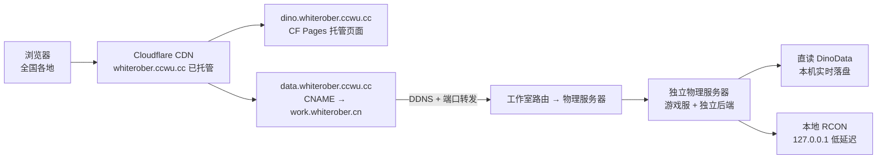

# dino-import.html 独立出 hass 规划

> 版本：v3.1 · 日期：2026-08-28
> 状态：规划（待确认后实施）
> 范围：整体独立系统计划第一步——将 `dino-import.html`（生物数据浏览器）从 Home Assistant 完全剥离
> 更新 v2.0：纳入用户 4 条基础设施约束——① 国内各地访问快 ② Cloudflare 付费会员 ③ 域名经香港 ECS 反代（已有）④ 独立物理服务器在家庭动态公网 IP 下，数据实时同步且流量受控
> 更新 v3.0：**改用 `whiterober.ccwu.cc`（已在 CF 账户内）直接落地**，跳过阿里云 DNS 迁移（whiterober.com 留在阿里云不动，零风险）。域名规划：`dino.whiterober.ccwu.cc`（页面）+ `data.whiterober.ccwu.cc`（数据/API 回源）
> 更新 v3.1：**数据回源不走香港 ECS**——`work.whiterober.cn` 是工作室路由 DDNS+端口转发直连物理服务器（非 ECS 反代），故 `data.whiterober.ccwu.cc` 直接 CNAME 到 `work.whiterober.cn`，香港 ECS 完全退出数据链路

---

## 1. 目标

让 `dino-import.html` 完全脱离 Home Assistant 运行：

- 页面不再由 HA 托管
- 静态数据不再依赖 HA `/local/`
- RCON 操作不再经 HA script/webhook/sensor
- 认证不再依赖 HA token

> 数据源（NAS `wiim.whiterober.com/dino-data/`、`/dino-import/`）**已独立**，剩余要切的是**页面托管、静态资源、RCON 后端、认证**四大块。

---

## 2. 现状盘点（已验证）

### 2.1 部署现状

| 层 | 现状 | 位置 |
|----|------|------|
| 页面托管 | HA `/config/www/dino-import.html` | `hass.whiterober.com/local/dino-import.html` |
| 本地源码 | `dino-import-new.html` | `b:\项目\Hass ASA Server Monitor\` |
| 数据源 JSON | NAS `/dino-data/`（cryo/tamed） | `wiim.whiterober.com` ✅ 已独立 |
| 导入 ini | NAS `/dino-import/` | `wiim.whiterober.com` ✅ 已独立 |
| **新域名** | CF 账户内已托管 | **`whiterober.ccwu.cc`**（Free，现有 5 条记录不动） |
| ~~whiterober.com~~ | 阿里云解析，**不迁移** | 保持现状，零风险 |

### 2.2 HA 依赖清单（需解耦）

#### ① 静态文件（8 个 `/local/asa-data/`）

| 文件 | 用途 |
|------|------|
| `icon_zh_map.json` | 汉化映射（ZH_MAP） |
| `gene_traits_zh.json` | 基因性状中文（LB_GENE_ZH） |
| `dino_prefix_zh.json` | 物种前缀中文（腐化/畸变等） |
| `dino_colors.json` | 颜色库（228 色） |
| `icon_anti_color.json` | 图标反色配置 |
| `icons2.json` | 图标索引（biology/units 391 条） |
| `refresh_status.json` | 刷新状态（免认证轮询） |
| `wild_status.json` | 野生状态基线（免认证轮询） |

#### ② RCON 动作 API（前端调用点）

| 前端调用 | 现行链路 | 用途 |
|----------|----------|------|
| `/api/services/script/refresh_tamed` | HA script → 事件 → AppDaemon → RCON | 刷新 tamed |
| `/api/services/script/search_wild_dinos` | 同上 | 搜野生 |
| `/api/services/script/track_dino` | 同上 | 实时追踪野生龙 |
| `/api/services/script/stop_track_dino` | 同上 | 停止追踪 |
| `/api/services/script/player_pos` | 同上 | 玩家位置/坐标 |
| `/api/webhook/refresh_tamed` | HA webhook → 事件 → AppDaemon | 免认证触发 |
| `/api/webhook/search_wild` | HA webhook → 事件 → AppDaemon | 免认证触发 |
| `/api/states/sensor.asa_server_themes` | HA sensor | 服务器主题（LB.SERVERS） |
| `/api/states/sensor.refresh_tamed_status` | HA sensor | 刷新状态轮询 |
| `/api/states/sensor.search_wild_status` | HA sensor | 搜野生状态轮询 |
| `/api/states/sensor.player_pos_status` | HA sensor | 玩家位置状态轮询 |
| `/api/websocket` | HA WS → `auth/current_user` | 自动识别玩家名 |

#### ③ 认证

- `localStorage.hassTokens`（HA 登录态）
- `externalAuth` bridge（手机 HA Companion App）
- `window.parent.hassConnection`（iframe 嵌入）
- `/api/websocket` → `auth/current_user`

#### ④ RCON 能力归属

- 现状：AppDaemon `asa_server_monitor_reliable.py`（apps.yaml `rcon_host`/`rcon_ports`，game 侧 work.whiterober.cn:323xx）
- 目标：独立后端服务

---

## 3. 目标架构（v3.0：基于 whiterober.ccwu.cc 落地）

### 3.1 网络链路

### 3.2 域名规划（在 CF 账户内新增，不碰阿里云）

| 子域 | 用途 | 类型 | 指向 |
|------|------|------|------|
| `dino.whiterober.ccwu.cc` | 页面（CF Pages） | CF Pages 自定义域 | Pages 项目 |
| `data.whiterober.ccwu.cc` | 数据 JSON + RCON API | CNAME/橙云 | **`work.whiterober.cn`**（DDNS 直连物理服务器） |
| ~~hass/wiim.whiterober.com~~ | 不动 | — | 阿里云保持现状 |
| ~~香港 ECS~~ | **数据链路退出** | — | 不再承担 dino 数据回源 |

### 3.3 分层职责

| 层 | 职责 | 说明 |
|----|------|------|
| **Cloudflare**（whiterober.ccwu.cc） | 页面托管 + 静态加速 + 边缘缓存 | 页面走 CF Pages；`data.` 子域开橙云代理做全国加速 |
| **work.whiterober.cn**（DDNS+端口转发） | 数据/API 回源通道 | 工作室路由 DDNS 直连物理服务器（已有）；为 dino 开新 HTTP 端口转发 |
| **物理服务器**（游戏服） | 独立后端 + 数据 + RCON | 后端与数据**同机**：直读 `D:\ARK Server\DinoData`（实时落盘即最新，零同步延迟）；RCON 走 127.0.0.1 |
| ~~HA~~ | 完全移除 | 页面/API/认证不再经过 HA |

**核心原则（实时 + 低流量）**：

1. **实时**：后端部署在游戏服本机，数据文件由 mod 直接落盘到本地 → 后端读本地 = 数据永远最新，**没有任何同步链路延迟**
2. **低流量**：
   - 前端增量拉取（已有 `lbHeadLm` HEAD+Last-Modified，未变化不下载）
   - 数据 JSON 走 **ETag/304 条件请求**，CF 边缘只回源变化的文件
   - 静态资源（页面/汉化/图标/颜色）长缓存，全国节点就近命中
   - RCON 动作**按需触发**（非轮询），刷新冷却 20s 沿用
   - 游戏服 → 前端全程**不落地中转**，不存在整文件同步带宽

---

## 4. 分阶段实施（按风险从低到高）

### 🟢 Phase 1：CF 域名准备 + 静态资源 + 页面迁移（低风险，先行）

1. **CF 新增记录**（在 `whiterober.ccwu.cc`，不动阿里云）：
   - `dino.whiterober.ccwu.cc` → CF Pages 自定义域
   - `data.whiterober.ccwu.cc` → **CNAME 指向 `work.whiterober.cn`**，开橙云代理
2. **工作室路由**：为物理服务器 dino 数据/API 服务开新 HTTP 端口转发（DDNS 已有，仅补端口）
3. 将 HA `/config/www/asa-data/` 的 8 个 JSON **复制**到物理服务器静态目录（建议 `/asa-data/`）
4. 将 `dino-import-new.html` 部署到 CF Pages（项目 `dino-import`，绑定 `dino.whiterober.ccwu.cc`）
5. 前端 URL 常量改绝对路径：`/local/asa-data/*` → `https://data.whiterober.ccwu.cc/asa-data/*`（`authFetch` 已支持内嵌凭据 URL）
6. **CF 缓存规则**：`/asa-data/*` 与页面设长 TTL（如 1 天 + 版本化 URL）；`/dino-data/*` 设 ETag 条件请求（no-cache 但 304 复用）
7. 浏览器验证：经 `dino.whiterober.ccwu.cc` 直开页面，汉化/图标/颜色全部正常

### 🟡 Phase 2：认证解耦（中等风险）

1. 移除 `hassTokens` / `externalAuth` / `hassConnection` / `/api/websocket` 全部 HA 认证路径
2. 玩家识别改为二选一：
   - **URL 参数** `?player=板板`（无登录，需接受"游客可看任意玩家"的降级）
   - **独立登录**：物理服务器侧 Basic 认证 + 页面内轻量登录表单（推荐，保留权限语义）
3. 页面自带「游客模式」提示（沿用现有 `lbShowLoginPrompt` 逻辑）

### 🔴 Phase 3：独立 RCON 后端（核心，高风险）

1. 在**物理服务器**新建后端服务（推荐 **Python FastAPI**，与游戏服同机，直读本机 DinoData）
2. **移植** AppDaemon 的 RCON 逻辑（`send_rcon_command_sync` + 各命令封装）到独立服务，**RCON 目标改为 127.0.0.1 本地**（游戏服同机）
3. 提供 HTTP API 替代 HA script/webhook：

| API | 替代 |
|-----|------|
| `POST /api/refresh_tamed?server=X` | script.refresh_tamed + webhook |
| `POST /api/search_wild?server=X&species=Y` | script.search_wild_dinos + webhook |
| `POST /api/track_dino` | script.track_dino |
| `POST /api/stop_track_dino` | script.stop_track_dino |
| `POST /api/player_pos` | script.player_pos |
| `GET /api/themes` | sensor.asa_server_themes |
| `GET /api/status/:server` | 4 个 sensor 轮询（ok/cooldown/error） |

4. 状态文件 `refresh_status.json` / `wild_status.json` 改由后端写入静态目录（免认证轮询保留）
5. 前端 `LB.SVC_*` / `LB.SVC_WILD` 等常量改为 `https://data.whiterober.ccwu.cc/api/*`
6. 保留 webhook 语义（免认证触发，仅内网）
7. **回源通道**：`data.whiterober.ccwu.cc` CNAME → `work.whiterober.cn`（DDNS+端口转发直连物理服务器）；IP 变化由 DDNS 自动更新，无需隧道

### ⚪ Phase 4：HA 侧清理（收尾）

1. 删除 `/config/www/dino-import.html`（或保留一个 301 跳转壳）
2. lovelace「方舟」视图生物入口改为外链 `dino.whiterober.ccwu.cc`（iframe 或新窗口）
3. 评估 AppDaemon `asa_server_monitor_reliable.py`：若 RCON 全部迁出，可停用相关事件监听
4. 最终验证：断网 HA 场景下页面全功能可用

---

## 5. 风险与前置条件

| 风险 | 说明 | 对策 |
|------|------|------|
| DDNS IP 变化 | 家庭 IP 变动导致回源断链 | work.whiterober.cn 已有 DDNS 自动更新；CF 橙云双兜底 |
| 实时性 vs 缓存 | CF 缓存可能延迟数据更新 | 数据 JSON 用 ETag/304 而非长缓存；静态资源才长缓存 |
| 流量控制 | 大 JSON（cryo 2.2MB）全量下载 | 前端增量拉取（HEAD+Last-Modified）+ ETag + 按需 RCON |
| 全国访问速度 | 回源走 DDNS 直连，内陆延迟取决于路由 | CF 边缘缓存静态资源 + 橙云代理全国加速 |
| 数据落盘 | 刷新后 DinoData 写入仍需游戏插件链路 | 后端与本机同机，实时直读，无中转 ✅ |
| 端口合规 | 物理服务器新开 HTTP 端口暴露公网 | 仅开放 dino 数据/API 端口，配合 Basic 认证；work 现状为游戏端口无界面 |
| 域名切换 | `whiterober.com` 保留阿里云，新域名 `ccwu.cc` | 前端数据 URL 全量改为 `data.whiterober.ccwu.cc`；旧域名可并行过渡 |

---

## 6. 验收标准

- 在 **`dino.whiterober.ccwu.cc`** 直接打开 `dino-import.html`，不经过 hass.whiterober.com 任何路径
- 汉化/图标/颜色/速查/繁育/追踪/搜野生/玩家位置全部可用（数据走 `data.whiterober.ccwu.cc`）
- **实时性**：游戏内新增/变化生物，页面刷新即可见（后端同机直读，无同步延迟）
- **低流量**：数据未变化时增量拉取只发 HEAD/304，不下载整文件；RCON 按需触发
- **全国访问**：各地浏览器打开静态资源命中 CF 边缘缓存，速度明显优于纯香港回源
- **HA 独立**：HA 停机不影响页面任何功能
- **阿里云零改动**：whiterober.com 解析保持原样，无迁移风险
- 手机浏览器 + PC 均正常
