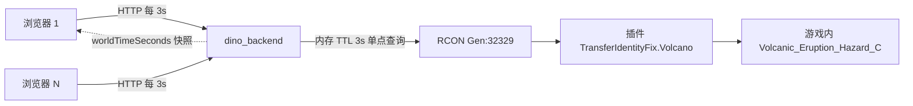

# 计划：火山计时「权威数据」改造（Gen）

> 前置计划：`计划_火山计时功能条.md`（V1–V6 已实装，线上 v20260913-1106）
> 数据来源文档：`报告/火山喷发状态查询_前端调用文档.md`（插件 `TransferIdentityFixAPI` v0.5.0）
> 创建：2026-09-14 · 状态：**已实施**（v20260914-1107 已上线；后端已推送待重启）

---

## 一、背景：数据源换代（为什么要改）

| | 旧方案（v1081～v1106 已上线） | 新方案（本次改造） |
|---|---|---|
| 数据来源 | **玩家手动校准**：7 个事件点按钮，人工点击 | **游戏内装置本体**：`TransferIdentityFix.Volcano` RCON 查询 |
| 时序推算 | 前端拟合模型：周期 472 游戏分、速度 13.57、相位表 | 权威字段：`phase` / `nextEventInSec` / `worldTimeSeconds` |
| 前提 | 3 个周期内必须有人校准过 | 玩家在线与否无关，装置常驻世界 |
| 误差来源 | 点击反应误差（±30s 缓冲）、服务器时钟与本地差（−86s）、周期拟合漂移 | **仅剩网络/轮询延迟（3～5s）** |
| 失效场景 | 锚点过期（>3 周期）→ `--:--` 强制重校 | 只有换图/世界重启时短暂无数据 |

> 结论：改造目标是**把倒计时数据源从「人工校准 + 拟合」换成「权威查询 + 本地外推」**；人工校准降级为兜底，拟合模型与时钟偏差 hack 全部退场。

---

## 二、新数据语义（来自插件文档，字段即用，不猜）

| 字段 | 前端用法 |
|---|---|
| `phase` | 状态机主键：`idle` 空闲 / `warmup` 预热（地震表现期）/ `eruption` 喷发中 / `cooldown` 冷却 |
| `nextEventInSec` | 距下次事件秒数（**可为负** = 已过公式点） |
| `worldTimeSeconds` | **权威世界时钟**（1:1 现实秒）→ 本地外推的唯一基准 |
| `anyEventActive` | `1` → 显示「事件进行中」，隐藏倒计时 |
| `dueNow` | `1` 且 `remain ≤ 0` → 「已到点，等待触发条件」（存在门控，不是错误） |
| `between` / `elapsedSec` | 事件间隔 / 距上次事件已过秒数（实测 `between=400`，**以运行时为准，不硬编码**） |
| `falseStartInt` / `maxFalseStarts` | 假喷发进度（实测 0/2）→ 「假喷发 N/M」 |
| `cache.ageSec` | 数据新鲜度 → 「更新于 Xs 前」 |
| `ok=false` + `error:"hazard actor not found"` | → 「本图无火山事件」（不是报错） |

---

## 三、目标形态（用户可见）

浮窗打开即显示真实状态，**无需任何人先校准**：

| 场景 | 大字 | 副行 | 颜色 |
|---|---|---|---|
| `idle` 倒计时中 | `mm:ss` | `距下次事件 · 现实 HH:MM:SS` | 灰/主题 |
| 距事件 ≤120s（含 `warmup`） | `mm:ss` | 同上 | **大红色 #ef4444** |
| `eruption` | `喷发中` | 独立小号「喷发结束倒计时 mm:ss」 | 橙 #f97316（可保持 v1105 规则） |
| 刚喷完 ≤30s | `mm:ss` | 距下次事件 | **大红色** |
| `warmup` | `预热中` | 「地震表现期 · 距喷发 mm:ss」 | 黄 |
| `cooldown` | `冷却中` | 「距下次事件 mm:ss」 | 蓝 |
| `dueNow` | `已到点` | 「等待触发条件（需玩家在火山附近）」 | 橙 |
| 无数据 | `--:--` | 「权威数据不可达 · 回退手动校准」 | 灰 |

保留元素：大倒计时字号 30px、双时间格式（现实 HH:MM:SS ｜ 游戏 +XhYm）、假喷发进度、数据来源行。
新增元素：`数据来源：游戏内装置（插件 v0.5.0）· 更新于 Xs 前`。

---

## 四、架构（对齐文档 §4：后端单点 + 前端读缓存）

- **后端**：唯一 RCON 发起方；内存缓存 TTL 3s → N 个客户端也只产生「每 3s 一次」查询。
- **前端**：每 3s 拉一次；**1s 本地外推**（`worldSec + (Date.now() − 收到时刻)/1000`），不靠加频刷新，也不直连 RCON。
- **时钟口径**：一律以 `worldTimeSeconds` 为基准 → **彻底删除 v1102 的 `lbVolcSkew`（服务器/本地时差 −86s）补偿逻辑**。

---

## 五、改造步骤

### V1 后端接入（P0）——`独立后端/dino_backend.py`

| # | 改动点 | 内容 |
|---|---|---|
| 1 | 命令常量 | `CMD_VOLCANO = 'TransferIdentityFix.Volcano'`（`fresh` 版本按需拼参） |
| 2 | 白名单 | 复用 `VOLCANO_SERVERS = {'Gen'}` |
| 3 | 函数 | `volcano_state(server, fresh=None)`：内存 `_VOLC_CACHE={server:{ts,data}}`，`now-ts < 3s` 直接复用；否则 `_rcon_str(SERVERS[server], CMD_VOLCANO, timeout=8)` → 解析 JSON → 缓存 |
| 4 | 返回增强 | 透传插件字段 + `cacheAge`（本后端缓存年龄）+ `serverNowMs`（回包时刻，便于前端校准外推） |
| 5 | 路由 | `elif path.endswith('volcano_state'):`（`fresh=1` 跳过 TTL，仅调试用） |
| 6 | 错误分支 | RCON 异常→`{ok:false,error:'rcon: ...'}`；`hazard actor not found` 原样透传（前端识别为「本图无火山」） |

**验证**：连续两次调用间隔 <3s → `cacheAge` 变化但字段一致；`fresh=1` → `worldTimeSeconds` 前进。
**部署**：`tmp/_push_backend.py` 推送（自动备份 + MD5 校验），**须由用户在服务器重启 `dino_backend.py`**。

### V2 前端数据层（P0）——`dino-import.html`

- 新增 `lbVolcSync()`：`fetch('/api/volcano_state', {server:'Gen'})` → 存 `LB._volcS = {worldSec, localMs, phase, active, dueNow, nextEventInSec, falseStartInt, maxFalseStarts, ageSec}`。
- 新增 3s 定时器 `LB._volcPoll`：**仅在浮窗打开时**运行（`lbVolcanoOpen` 启动 / `lbVolcClose` 清除）。
- 保留 1s `lbVolcRender()` 只做本地外推与绘制。

### V3 渲染改造（P0）

- `lbVolcView()`：按 §三 表格生成主体块；`remain = (worldSec + nextEventInSec) − (worldSec + 本地流逝秒)`。
- 大红色判定改权威口径：`remain ≤ 120s` 或 `phase==='cooldown' && elapsedSec ≤ 30s`。
- 删除/折叠：7 个校准按钮 + 「上次校准/锚点年龄/有效周期」信息块。

### V4 降级与兼容（P1）

- 查询失败或插件未部署 → 顶部黄条「权威数据不可达」，**回退**旧锚点显示（保留 `volcano_anchor` 读接口 1 个版本）。
- `error:'hazard actor not found'` → 「本图无火山事件」，隐藏倒计时（不报错）。
- `anyEventActive=1` → 显示「事件进行中」并隐藏倒计时（文档 §7 建议）。

### V5 功能条增强（P2，可选）

`#lbFuncActions` 的火山按钮显示迷你状态（`🌋 12:34` / `🌋 喷发中`），同样 1s 本地外推、**不额外发请求**（复用浮窗数据；浮窗关闭时用最后一次快照外推，超过 60s 未更新则回退纯文字）。

### V6 清理（P2）

- 删除 `LB_VOLC.phases` 相位表、`lbVolcNodeOffG`、`lbVolcCalibrate`、`lbVolcSkew/lbVolcSetSkew/lbVolcSkewFromTs`、`lbVolcDT`。
- `volcano_anchor` 端点标记 deprecated（保留 1 版兜底后移除）。

---

## 六、测试计划

1. **后端**：`ok:true`、`class=Volcanic_Eruption_Hazard_C`；同秒两次调用内容一致（TTL 生效）；`fresh=1` 时 `worldTimeSeconds` 前进。
2. **前端**：浮窗打开 1s 递减不跳变；状态迁移 `idle→warmup→eruption→cooldown` 分别截图核对；未到 120s 不变红、进入 120s 变红；`eruption` 显示「喷发中」+ 小倒计时。
3. **并发**：10 个页面同时开浮窗 → 后端日志 `VOLCANO` 行数仍是每 3s 1 条（×10 倍即为不达标）。
4. **降级**：临时把后端缓存关掉/停 RCON → 前端出现「权威数据不可达」黄条而非空白。
5. **移动端**：`pwa/sw.js` 的 `VER` 同步新版本号，卸载重装验证换壳。

---

## 七、验收标准

- [ ] 关掉一切人工校准，倒计时与游戏内实际喷发时刻误差 ≤ 2s。
- [ ] 喷发开始瞬间大字变「喷发中」+ 小倒计时；喷发结束 30s 内大红色；临喷发 120s 内大红色。
- [ ] 多客户端并发不增加 RCON 查询量（后端单点）。
- [ ] 无数据/无火山两种异常均有明确文案，不出现空白或英文错误串。

---

## 八、风险与规避

| 风险 | 影响 | 规避 |
|---|---|---|
| 插件未在全部服部署 | 只有 Gen 可用 | 复用 `VOLCANO_SERVERS` 白名单，其它服隐藏功能条 |
| RCON 在游戏线程执行 | 高频查询挤占主线程 | 后端单点 + TTL 3s + 前端不直连（文档 §4 强约束） |
| 依赖 `between=400` 等实测值 | 换版本后漂移 | **只用返回字段计算，绝不硬编码周期/速度** |
| 世界重启/换图 → 装置指针失效 | 短暂无数据 | 透传 `cache.scans`，前端显示「数据不可达」+ 指数退避轮询 |
| 旧锚点数据与新逻辑并存 | 显示口径混淆 | V4 保留 1 版兜底后 V6 清理 `volcano_anchor` |
| 部署依赖用户重启后端 | 新接口 404 | 推送后立即提示用户重启（历史同类教训） |

---

## 九、待用户拍板（4 项）

1. **人工校准 UI**：完全删除 ／ 保留为「备用校准」折叠区？（推荐：保留 1 版折叠，兜底插件异常）
2. **缓冲窗口 ±30s**：权威数据无点击误差 → 改为「数据新鲜度：Xs 前」？（推荐：改）
3. **前端轮询间隔**：3s（响应快）／ 5s（更省）？（推荐：3s，浮窗关闭即停）
4. **功能条迷你倒计时**（V5）：现在做 ／ 留到下一轮？

---

## 附：涉及文件与复用锚点

| 文件 | 角色 |
|---|---|
| `独立后端/dino_backend.py` | V1：新增 `CMD_VOLCANO` / `volcano_state()` / 路由 |
| `tmp/_push_backend.py` | 后端推送（自动备份 + MD5），结果写 `tmp/_push_backend.txt` |
| `dino-import.html` | V2–V6：`lbVolc*` 全家族改造 |
| `pwa/sw.js` | 版本号同步（强制移动端换壳） |
| `tmp/_deploy_cf.py` | 前端一键部署（打包 → wrangler → 线上验证） |

现成可复用：`_rcon_str(port, cmd, timeout)`、`_VOLC_CACHE` 风格的 TTL 缓存（参考 `player_pos` 1.5s 缓存写法）、`.lb-picker-overlay/panel` 浮窗壳、`lbVolcFmt/lbVolcGameOf/lbVolcClock` 格式化工具。

---

## 实施记录（2026-09-14）

### 拍板结果（用户）
1. 人工校准 UI —— **完全删除**（不保留折叠兑底）
2. 缓冲窗口 ±30s —— 改为「**数据新鲜度：Xs 前**」（插件 `cache.ageSec` ＋ 本地外推）
3. 前端轮询 —— **3s**（仅浮窗打开时；功能条可见但浮窗关闭时降为 30s 轻轮询）
4. 功能条迷你倒计时 —— **本期实装**（`🌋 mm:ss` / `🌋 喷发中` / `🌋 已到点`；快照过期 >60s 回退纯文字）
   - 补充：int32 字段（`maxFalseStarts`）**不加守卫**（用户：后端已在修；实测已返回正确值 `2`）

### 后端（`独立后端/dino_backend.py`，已推送 `MATCH=True`）
- 新增 `CMD_VOLCANO = 'TransferIdentityFix.Volcano'`、`VOLC_STATE_TTL_MS=3000`、`_VOLC_STATE_CACHE`、`volcano_state(server, fresh)`（失败结果也缓存 3s 防空跑）、路由 `path.endswith('volcano_state')`
- 旧 `volcano_anchor` 端点标记**已弃用**（保留兼容），备份 `dino_backend.py.bak_20260914_152803`
- ⚠️ **需用户在物理服务器重启 `dino_backend.py`** 后新接口才生效

### 前端（`dino-import.html`，v20260914-1107 已上线 `版本一致: True`）
- 新数据层：`lbVolcSync` / `lbVolcPollStart|Stop` / `lbVolcSlowStart|Stop` / `lbVolcFuncTick` / `lbVolcRemainMs`（worldTime 本地外推）/ `lbVolcFreshMs` / `lbVolcMini`
- 渲染：phase 四态 + `dueNow` 门控 + `anyEventActive` 事件中 + 假喷发 N/M + 数据新鲜度 + 装置/关卡；大红色沿用两张规则（≤120s / cooldown 且 ≤30s）
- 删除：7 个校准按钮、锚点信息块、`lbVolcCalibrate/Load/Next/PhaseOf/NodeOffG/NodeName`、`lbVolcSkew*`（含 `lbVolcDT`）、`LB_VOLC.phases/cycleG/validCycles/bufMs`
- PWA：`pwa/sw.js` VER 已同步 v20260914-1107

### 实测（浏览器注入快照验证）
| 场景 | 大字 | 颜色 | 结果 |
|---|---|---|---|
| idle（300s） | `5:00` | rgb(148,163,184) | ✅ 灰 |
| 距喷发 100s | `1:40` | rgb(239,68,68) | ✅ 大红 |
| eruption | `喷发中` | 红 | ✅ ＋「喷发已持续 0:42」「距下次事件 5:58」 |
| cooldown +12s | `6:28` | 红 | ✅ 刚喷完 30s 内 |
| cooldown +95s | `5:05` | rgb(96,165,250) | ✅ 蓝 |
| warmup | `1:20` | 红 | ✅ 标签「预热中（地震表现期）· 距喷发」 |
| dueNow | `已到点` | rgb(245,158,11) | ✅「等待触发条件（需玩家在火山附近）」 |
| 无火山 | — | — | ✅「⚠️ 本图无火山事件」头黄条 |
| 功能条 | `🌋 喷发中` | — | ✅ 迷你倒计时 |

### 新发现（待处理）
- **`between` 实测 = 400s**（旧拟合模型 472 游戏分 ≈ 2087s **不正确**）⇒ 证实「只用返回字段、不硬编码周期」是必要的
- `phase=eruption` 时 `nextEventInSec` 指**下轮事件**，**拿不到喷发结束时刻** ⇒ 当前大字下方显示「喷发已持续 mm:ss」；若要恢复「喷发结束倒计时」需插件返喷发时长或实测一次 eruption→cooldown 时长
- 采样脚本 `tmp/_volc_probe.py` → `tmp/_volc_probe.txt` 正在后台跑（12 分钟，每 15s 一条），用于测相位迁移与喷发时长
